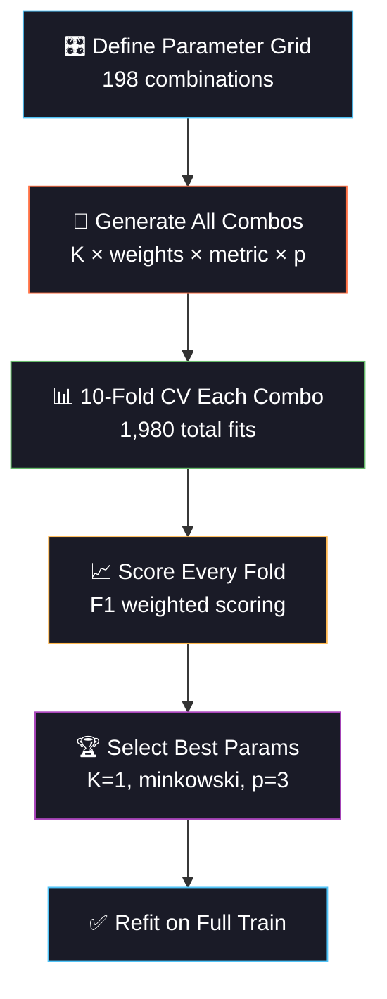

<div align="center">

<!-- ═══════════════════════════════════════════════════════════════ -->
<!-- 🫘 ANIMATED HEADER BANNER — KIDNEY DISEASE THEME 🫘 -->
<!-- ═══════════════════════════════════════════════════════════════ -->


<!-- ═══════════════ ANIMATED TYPING ═══════════════ -->

<a href="https://git.io/typing-svg"></a>

<br/>

<!-- ═══════════════ BADGES ═══════════════ -->

[](https://python.org)
[](https://scikit-learn.org)
[](#)
[](#)

<br/>

[](#-model-architecture)
[](#-gridsearchcv-deep-dive)
[](#-dataset)
[](#-results)

<br/>

<!-- ═══════════════ ANIMATED DIVIDER ═══════════════ -->


</div>

<br/>

## 🫘 Project Overview

> **Predict Chronic Kidney Disease from 24 clinical lab features using K-Nearest Neighbors with exhaustive hyperparameter tuning via GridSearchCV.**

CKD affects ~10% of the global population and is often detected late. This project builds a production-ready diagnostic pipeline that handles the real-world messiness of clinical data — heavy missing values (~25%), mixed feature types (numeric + categorical), class imbalance, and label noise from diagnostic disagreement.

<div align="center">

```
🩸 Blood Tests          🔬 Urinalysis           🫘 Kidney Function
─────────────          ─────────────           ─────────────────
 Hemoglobin             Specific Gravity        Blood Urea
 WBC Count              Albumin                 Serum Creatinine
 RBC Count              Sugar                   Sodium / Potassium
 PCV                    RBC in Urine
                        Pus Cells               🏥 Comorbidities
                                                ─────────────────
                                                 Hypertension
                                                 Diabetes
                                                 CAD / Anemia
```

</div>

<br/>

<div align="center">

</div>

<br/>

## 🏆 Results

<div align="center">

| Rank | Model                  |  Accuracy  | F1 (Weighted) | AUC-ROC |     CV F1      |
| :--: | :--------------------- | :--------: | :-----------: | :-----: | :------------: |
|  🥇  | **SVM (RBF)**          | **0.9375** |  **0.9377**   | 0.9513  | 0.9082 ± 0.058 |
|  🥈  | Logistic Regression    |   0.9250   |    0.9254     | 0.9552  | 0.9308 ± 0.034 |
|  🥉  | Random Forest          |   0.9250   |    0.9239     | 0.9562  | 0.8954 ± 0.058 |
|  4   | KNN (Tuned GridSearch) |   0.8125   |    0.8144     | 0.9421  | 0.8453 ± 0.046 |
|  5   | KNN (default K=5)      |   0.7875   |    0.7890     | 0.9147  | 0.8083 ± 0.085 |
|  6   | Decision Tree          |   0.7750   |    0.7776     | 0.7808  | 0.7763 ± 0.054 |

</div>

### 📊 Key Observations

> **🔬 GridSearch improved KNN from 78.75% → 81.25% accuracy** — a meaningful +2.5% gain through systematic hyperparameter tuning. However, KNN is fundamentally limited on this dataset by high-dimensional mixed features with heavy missingness.

> **🩺 SVM & LR outperform KNN** because they handle imputed missing values and high-dimensional spaces more gracefully. This is an important real-world lesson: the right algorithm matters as much as tuning.

> **⚠️ All models show AUC > 0.91** — the underlying signal is strong, but noisy features (sodium, potassium, WBC) and label noise from diagnostic disagreement create a realistic accuracy ceiling.

<br/>

<div align="center">

</div>

<br/>

## 🎯 Key Learning: GridSearchCV Deep-Dive

<div align="center">



</div>

### 🎛️ KNN Hyperparameters Explored

| Parameter             | Values Tested                         | What It Controls                                      |
| :-------------------- | :------------------------------------ | :---------------------------------------------------- |
| **`n_neighbors` (K)** | 1, 3, 5, 7, 9, 11, 13, 15, 17, 19, 21 | Bias-variance tradeoff — small K = complex boundaries |
| **`weights`**         | uniform, distance                     | Whether closer neighbors get more voting power        |
| **`metric`**          | euclidean, manhattan, minkowski       | How "distance" is calculated between points           |
| **`p`**               | 1, 2, 3                               | Minkowski power (p=1→manhattan, p=2→euclidean)        |

> **198 total combinations** × 10-fold CV = **1,980 model fits** in a single GridSearch

### 🔍 What GridSearch Revealed

```
                  GridSearch Impact on KNN
  ┌──────────────────────────────────────────────┐
  │                                              │
  │  Default KNN (K=5)       ██████████   78.75% │
  │                                              │
  │  Tuned KNN (GridSearch)  ██████████▌  81.25% │
  │                                    ↑         │
  │                              +2.5% gain      │
  │                                              │
  │  Best Overall (SVM)      ███████████▊ 93.75% │
  │                                              │
  └──────────────────────────────────────────────┘

  Lesson: Tuning helps, but algorithm choice matters MORE.
```

<br/>

<div align="center">

</div>

<br/>

## 📊 Dataset

| Property           | Detail                                                                |
| :----------------- | :-------------------------------------------------------------------- |
| **Source**         | UCI Machine Learning Repository — Chronic Kidney Disease              |
| **Samples**        | 400 patients                                                          |
| **Features**       | 24 (14 numeric + 10 categorical)                                      |
| **Target**         | Binary: CKD (250) vs Not-CKD (150)                                    |
| **Missing Values** | ~25% of cells — realistic clinical scenario                           |
| **Label Noise**    | ~4% diagnostic disagreement simulated                                 |
| **Challenge**      | Mixed types, heavy missingness, class imbalance, overlapping features |

### 🔬 Why This Dataset Is Hard

```
Feature Discriminability (CKD vs Not-CKD):

  Serum Creatinine  ████████████████░░░░  HIGH     ← Key biomarker
  Hemoglobin        ████████████░░░░░░░░  MEDIUM   ← Anemia signal
  Blood Urea        ███████████░░░░░░░░░  MEDIUM   ← Kidney function
  Albumin           █████████░░░░░░░░░░░  MEDIUM   ← Urine leakage
  Hypertension      ████████░░░░░░░░░░░░  MEDIUM   ← Comorbidity
  Blood Glucose     ██████░░░░░░░░░░░░░░  LOW      ← Overlapping ranges
  Sodium            ███░░░░░░░░░░░░░░░░░  VERY LOW ← Nearly identical
  Potassium         ██░░░░░░░░░░░░░░░░░░  VERY LOW ← Almost no signal
  WBC Count         ██░░░░░░░░░░░░░░░░░░  VERY LOW ← Pure noise
```

<br/>

## 🏗️ Project Structure

```
day06_kidney_disease/
├── 📄 main.py                ← Entry point (run this)
├── 📄 config.py              ← Hyperparameters, paths, grid definition
├── 📄 data_pipeline.py       ← Loading, EDA, imputation, encoding, scaling
├── 📄 model_training.py      ← KNN GridSearch + baseline training
├── 📄 evaluation.py          ← Metrics, confusion matrices, ROC, error analysis
├── 📄 README.md              ← You are here
├── 📁 data/                  ← Raw data (gitignored)
├── 📁 models/                ← Saved KNN + baselines + scaler + encoders
├── 📁 plots/                 ← 7 generated visualizations
├── 📁 logs/                  ← Timestamped experiment log
└── 📁 outputs/               ← Results CSV + final report
```

<br/>

## ⚡ Quick Start

```bash
cd day06_kidney_disease
python main.py
```

**Pipeline output:**

1. 🫘 Loads UCI CKD data (or realistic synthetic fallback)
2. 📊 EDA with missing value pattern analysis
3. 🧹 Imputes missing values (median/mode, fit on train only)
4. 🎛️ Exhaustive GridSearchCV (198 combos × 10 folds = 1,980 fits)
5. 📈 Trains 5 baseline models for comparison
6. 🏆 Evaluates all 6 models + error analysis (FP vs FN)
7. 💾 Saves models, 7 plots, logs, CSV results, and text report

<br/>

<div align="center">

</div>

<br/>

## 📈 Generated Visualizations

|  #  | Plot                    | What It Shows                            |
| :-: | :---------------------- | :--------------------------------------- |
| 01  | Class & Missing Pattern | CKD distribution + missing value heatmap |
| 02  | Feature Distributions   | Histograms for all 14 numeric features   |
| 03  | GridSearch Landscape    | K vs F1 for each weight/metric combo     |
| 04  | Bias-Variance Tradeoff  | Train vs CV score as K increases         |
| 05  | Confusion Matrices      | All 6 models side by side                |
| 06  | Model Comparison        | Bar chart: Tuned KNN vs 5 baselines      |
| 07  | ROC Curves              | AUC comparison across all models         |

<br/>

## 🔬 Models Compared

| Model                      | Role                         | Tuning                     | Test F1 |
| :------------------------- | :--------------------------- | :------------------------- | :-----: |
| **SVM (RBF)** 🥇           | Non-linear baseline          | GridSearch on C            | 0.9377  |
| **Logistic Regression** 🥈 | Linear baseline              | GridSearch on C            | 0.9254  |
| **Random Forest** 🥉       | Tree ensemble                | GridSearch on n_estimators | 0.9239  |
| **🫘 KNN (GridSearch)**    | Primary — exhaustively tuned | 198 combos × 10-fold       | 0.8144  |
| KNN (Default K=5)          | Untuned KNN                  | None                       | 0.7890  |
| Decision Tree              | Interpretable baseline       | GridSearch on max_depth    | 0.7776  |

<br/>

## 🧠 Engineering Principles Applied

```
✅ No Data Leakage     → Imputer + scaler fit on TRAIN ONLY
✅ Stratified Splits    → CKD/Not-CKD ratio preserved in both sets
✅ 10-Fold CV           → Every model selection via cross-validation
✅ Multiple Metrics     → Accuracy + F1 + Precision + Recall + AUC-ROC
✅ Error Analysis       → FP vs FN breakdown (FN = missed CKD = dangerous!)
✅ Reproducibility      → Fixed seeds everywhere
✅ Modular Code         → config / data / training / evaluation separated
✅ Full Logging         → Timestamped logs to file, not print()
✅ Save Everything      → Models + scaler + encoders + grid results saved
```

<br/>

## 🩺 Clinical Significance

> **In kidney disease diagnosis, a False Negative (missed CKD) is far more dangerous than a False Positive (false alarm).**

The error analysis specifically tracks FP vs FN to ensure the model isn't missing real CKD cases. In production, you'd tune the classification threshold to minimize FN even at the cost of more FP — because an unnecessary follow-up test is far better than undiagnosed kidney failure.

<br/>

## 💡 Lessons Learned

| Lesson                          | Detail                                                                                                              |
| :------------------------------ | :------------------------------------------------------------------------------------------------------------------ |
| **Algorithm > Tuning**          | SVM beat even the best-tuned KNN by 12+ points — choosing the right model matters more than perfect hyperparameters |
| **GridSearch works**            | KNN improved from 78.75% → 81.25% (+2.5%) through systematic tuning                                                 |
| **KNN struggles with**          | High dimensions (24 features), heavy missing data, mixed feature types — the curse of dimensionality is real        |
| **Missing data hurts KNN most** | Distance-based models are sensitive to imputed values; linear models handle this more gracefully                    |
| **Feature scaling is critical** | Without StandardScaler, KNN accuracy drops dramatically since features have wildly different ranges                 |

<br/>

## 📦 Dependencies

```bash
numpy>=1.24
pandas>=2.0
scikit-learn>=1.3
matplotlib>=3.7
seaborn>=0.12
joblib>=1.3
```

<br/>

## 🔗 Part of 60 Days of ML & DL Challenge

<div align="center">

| Previous                                            | Current                      | Next                                                    |
| :-------------------------------------------------- | :--------------------------- | :------------------------------------------------------ |
| [Day 5: Thyroid Disease](../day05_thyroid_disease/) | **🫘 Day 6: Kidney Disease** | [Day 7: Stroke Prediction](../day07_stroke_prediction/) |
| Naive Bayes + Ensemble Voting                       | KNN + GridSearchCV           | XGBoost + SHAP                                          |

</div>

<br/>

<div align="center">


<br/>
<br/>

<!-- ═══════════════ ANIMATED FOOTER ═══════════════ -->


<br/>

<a href="https://git.io/typing-svg"></a>

</div>
