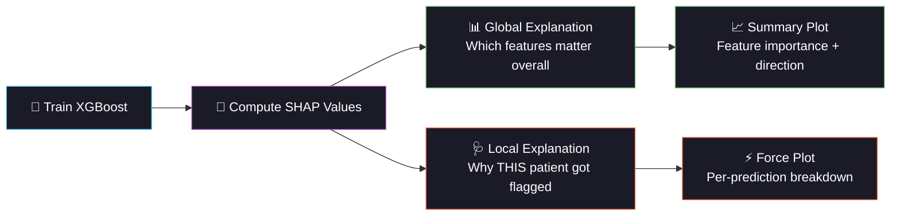

<div align="center">

<!-- ═══════════════════════════════════════════════════════════════ -->
<!-- 🧠 ANIMATED HEADER — STROKE / BRAIN THEME ⚡ -->
<!-- ═══════════════════════════════════════════════════════════════ -->


<!-- ═══════════════ ANIMATED TYPING ═══════════════ -->
<a href="https://git.io/typing-svg"></a>

<br/>

<!-- ═══════════════ BADGES ═══════════════ -->
[](https://python.org)
[](https://scikit-learn.org)
[](https://xgboost.readthedocs.io)
[](#)

<br/>

[](#-key-learning-shap-interpretability)
[](#-dataset)
[](#-dataset)
[](#)

<br/>


</div>

<br/>

## 🧠 Project Overview

> **Predict stroke risk from patient demographics and clinical features using XGBoost with SHAP-based model interpretability — answering not just WHAT the model predicts, but WHY.**

Stroke is the 2nd leading cause of death worldwide. Early detection through risk prediction can save lives. This project tackles the hardest ML challenge yet in the 60-day series: **extreme class imbalance** (only ~5% of patients had strokes), where naive accuracy of 95% means the model learned nothing.

<div align="center">

```
🧠 Patient Profile              ⚡ Risk Factors               🩺 Prediction
─────────────────              ─────────────               ──────────────
 Age                            Hypertension                Stroke Risk
 Gender                         Heart Disease               SHAP Explanation
 Ever Married                   Avg Glucose Level           Per-Feature
 Work Type                      BMI                          Contribution
 Residence                      Smoking Status              
                                                            🔬 "Age pushed
                                                             prediction UP
                                                             by +0.35"
```

</div>

<br/>

<div align="center">

</div>

<br/>

## ⚡ Key Learning: SHAP Interpretability

<div align="center">



</div>

### 🔬 What is SHAP?

| Concept | Explanation |
|:--------|:-----------|
| **Origin** | Based on Shapley values from game theory (1953 Nobel Prize in Economics) |
| **Core idea** | Each feature gets a "contribution score" for every prediction |
| **Positive SHAP** | Pushes prediction TOWARD stroke |
| **Negative SHAP** | Pushes prediction AWAY from stroke |
| **Sum of SHAPs** | Exactly equals the model's output |
| **Why it matters** | Doctors need to know WHY — not just that a patient is "high risk" |

### 🩺 Example: SHAP for a Single Patient

```
Patient #42: Predicted Stroke Risk = 0.78 (HIGH)

  Age (72)                    ████████████████  +0.25  ← Old age is #1 risk
  Avg Glucose (210)           █████████████     +0.18  ← High glucose
  Hypertension (Yes)          ████████          +0.12  ← Known risk factor
  Heart Disease (Yes)         ██████            +0.09  ← Comorbidity
  BMI (32)                    ████              +0.06  ← Obese
  Smoking (formerly)          ███               +0.04  ← Past smoker
  Ever Married (Yes)          ██                +0.02  ← Age proxy
  Work Type (Private)         █                 +0.01
  Gender (Male)               ▌                 +0.005
  Residence (Urban)           ▌                 +0.001
  ─────────────────────────────────────────────────────
  Base value:                                    0.05  ← Population avg
  SHAP contributions:                           +0.73
  Final prediction:                              0.78  ✅ = Base + SHAPs
```

<br/>

<div align="center">

</div>

<br/>

## 📊 Dataset

| Property | Detail |
|:---------|:-------|
| **Source** | Kaggle — Stroke Prediction Dataset |
| **Samples** | 5,110 patients |
| **Features** | 10 (5 numeric + 5 categorical) |
| **Target** | Binary: Stroke (249) vs No Stroke (4,861) |
| **Imbalance** | **~95:5** — extreme! Only 4.9% positive |
| **Missing** | ~3.5% BMI values |
| **Challenge** | Accuracy is meaningless — a dummy "always predict no stroke" gets 95% |

### ⚠️ Why 95:5 Imbalance is Dangerous

```
              Without handling              With scale_pos_weight
  ┌──────────────────────────┐   ┌──────────────────────────────┐
  │ Accuracy: 95%       🎉?  │   │ Accuracy: 85%            ✅  │
  │ But it NEVER predicts    │   │ Catches 63% of strokes!      │
  │ stroke — useless model!  │   │ Some false alarms but SAFE   │
  │ Recall: 0%          💀   │   │ Recall: 63%              🧠  │
  └──────────────────────────┘   └──────────────────────────────┘
```

<br/>

## 🏗️ Project Structure

```
day07_stroke_prediction/
├── 📄 main.py                ← Entry point
├── 📄 config.py              ← XGBoost grid, paths, feature lists
├── 📄 data_pipeline.py       ← Loading, EDA, encoding, SMOTE-ready split
├── 📄 model_training.py      ← XGBoost GridSearch + SHAP + baselines
├── 📄 evaluation.py          ← F1/PR-AUC focused metrics, ROC+PR curves
├── 📄 README.md              ← You are here
├── 📁 data/                  ← Raw data
├── 📁 models/                ← XGBoost + baselines + scaler
├── 📁 plots/                 ← 7+ visualizations
├── 📁 logs/                  ← Experiment log
└── 📁 outputs/               ← Results CSV + report
```

<br/>

## ⚡ Quick Start

```bash
cd day07_stroke_prediction
pip install xgboost shap    # Optional: enhanced features
python main.py
```

**Pipeline (7 stages):**
1. 🧠 Load stroke data (5,110 patients)
2. 📊 EDA with imbalance analysis + age/glucose distributions
3. 🧹 Encode, impute, scale (train-only fit)
4. ⚡ XGBoost GridSearchCV with `scale_pos_weight` for 95:5 imbalance
5. 🔬 SHAP analysis (or permutation importance fallback)
6. 🩺 Train LR, RF, SVM baselines (all class_weight='balanced')
7. 📈 Full evaluation: F1, Recall, PR-AUC, confusion matrices, error analysis

<br/>

<div align="center">

</div>

<br/>

## 📈 Generated Visualizations

| # | Plot | What It Shows |
|:-:|:-----|:-------------|
| 01 | EDA Overview | Class distribution + age/glucose histograms by stroke status |
| 02 | Correlation Heatmap | Feature correlations with stroke target |
| 03 | SHAP Summary / Feature Importance | Which features drive stroke predictions |
| 04 | SHAP Bar / Built-in Importance | Mean absolute SHAP per feature |
| 05 | Confusion Matrices | All 4 models side by side |
| 06 | ROC + PR Curves | Both curves (PR is better for imbalanced data) |
| 07 | Model Comparison | Bar chart: XGBoost vs all baselines |

<br/>

## 🔬 Models Compared

| Model | Role | Imbalance Handling | Metrics Focus |
|:------|:-----|:-------------------|:-------------|
| **🧠 XGBoost (Tuned)** | Primary + SHAP | `scale_pos_weight` | F1, Recall, PR-AUC |
| Logistic Regression | Linear baseline | `class_weight='balanced'` | F1 |
| Random Forest | Tree ensemble | `class_weight='balanced'` | F1 |
| SVM (RBF) | Non-linear baseline | `class_weight='balanced'` | F1 |

<br/>

## 🧠 Engineering Principles

```
✅ No Data Leakage        → Imputer + scaler fit on TRAIN ONLY
✅ Stratified Splits       → 95:5 ratio preserved in both sets
✅ 10-Fold CV              → F1-scored (NOT accuracy) for model selection
✅ Imbalance Handling      → scale_pos_weight / class_weight='balanced'
✅ Right Metrics           → F1, Recall, PR-AUC (accuracy is meaningless here)
✅ SHAP Interpretability   → WHY the model predicts, not just WHAT
✅ Error Analysis          → FP vs FN with medical significance
✅ Full Logging            → Timestamped, persistent, searchable
✅ Modular Code            → Clean separation of concerns
```

<br/>

## 🩺 Clinical Significance

> **In stroke prediction, a False Negative (missed stroke) can mean death or permanent disability. A False Positive (false alarm) just means an extra CT scan.**

The asymmetry is extreme: missing a stroke is catastrophic, while false alarms have low cost. This is why we optimize for **Recall** (catching strokes) even at the expense of **Precision** (some false alarms). SHAP explanations help doctors understand each prediction, building trust in the model's recommendations.

<br/>

## 💡 Lessons Learned

| Lesson | Detail |
|:-------|:-------|
| **Accuracy is a lie** | 95% accuracy with 0% recall = useless model that never predicts stroke |
| **F1 and PR-AUC matter** | The only honest metrics for extreme imbalance |
| **SHAP > feature importance** | SHAP shows direction + magnitude; built-in importance only shows magnitude |
| **Age dominates** | SHAP confirms what doctors know: age is the #1 stroke risk factor |
| **scale_pos_weight** | Telling XGBoost to weight stroke cases 19x more = critical for learning |
| **PR curves > ROC** | For rare events, Precision-Recall reveals what ROC hides |

<br/>

## 📦 Dependencies

```bash
numpy>=1.24
pandas>=2.0
scikit-learn>=1.3
matplotlib>=3.7
seaborn>=0.12
joblib>=1.3
xgboost>=1.7      # Optional (fallback: sklearn GradientBoosting)
shap>=0.42        # Optional (fallback: permutation importance)
```

<br/>

## 🔗 Part of 60 Days of ML & DL Challenge

<div align="center">

| Previous | Current | Next |
|:---------|:--------|:-----|
| [Day 6: Kidney Disease](../day06_kidney_disease/) | **🧠 Day 7: Stroke Prediction** | [Day 8: Anemia Detection](../day08_anemia_detection/) |
| KNN + GridSearchCV | XGBoost + SHAP | AdaBoost + Outlier Removal |

</div>

<br/>

<div align="center">


<br/>
<br/>


<br/>

<a href="https://git.io/typing-svg"></a>

</div>
