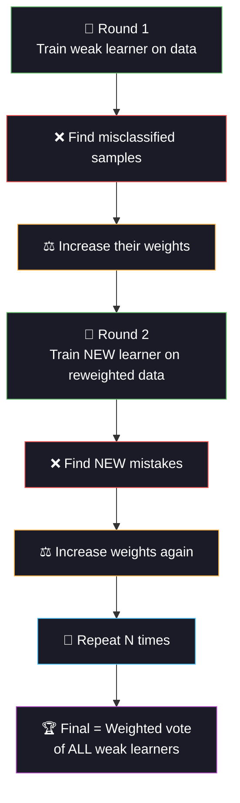

<div align="center">

<!-- ═══════════════════════════════════════════════════════════════ -->
<!-- 🩸 ANIMATED HEADER — ANEMIA / BLOOD THEME 🔬 -->
<!-- ═══════════════════════════════════════════════════════════════ -->


<!-- ═══════════════ ANIMATED TYPING ═══════════════ -->
<a href="https://git.io/typing-svg"></a>

<br/>

<!-- ═══════════════ BADGES ═══════════════ -->
[](https://python.org)
[](https://scikit-learn.org)
[](#)
[](#)

<br/>

[](#-key-learning-adaboost)
[](#-outlier-removal-methods)
[](#-scaling-strategies)
[](#-ablation-study)

<br/>


</div>

<br/>

## 🩸 Project Overview

> **Detect anemia from Complete Blood Count (CBC) results using AdaBoost, with a systematic ablation study comparing 4 outlier removal methods × 4 scaling strategies = 16 preprocessing pipelines.**

Anemia affects ~1.6 billion people globally — it's the most common blood disorder. A CBC blood test is cheap and fast, but interpreting results across multiple correlated biomarkers is where ML excels. This project focuses on the often-overlooked but critical preprocessing step: how outliers and feature scaling affect model performance.

<div align="center">

```
🩸 Complete Blood Count (CBC)
═════════════════════════════════════════════════════
  
  🔴 Red Cell Markers           🔬 Cell Indices
  ─────────────────           ─────────────
   Hemoglobin (g/dL)           MCV (fL)     ← Cell volume
   RBC Count (M/μL)            MCH (pg)     ← Hemoglobin/cell
                                MCHC (g/dL)  ← Concentration
  
  ⚪ White Cells                🟡 Platelets
  ─────────────                ──────────
   WBC Count (K/μL)             Platelet Count (K/μL)
  
  ═════════════════════════════════════════════════════
  🎯 Target: Hemoglobin < 12-13 g/dL = ANEMIC
```

</div>

<br/>

<div align="center">

</div>

<br/>

## ⚡ Key Learning: AdaBoost

<div align="center">



</div>

### 🧠 How AdaBoost Differs from Other Ensembles

| Method | Strategy | Key Idea |
|:-------|:---------|:---------|
| **AdaBoost** | Sequential, adaptive | Each learner fixes MISTAKES of the previous one |
| Random Forest | Parallel, bagging | Each tree sees random data subset independently |
| XGBoost | Sequential, gradient | Each tree fits the RESIDUAL error (gradient) |

### 🎛️ AdaBoost Hyperparameters

| Parameter | Values Tested | Effect |
|:----------|:-------------|:-------|
| **`n_estimators`** | 50, 100, 200, 300, 500 | More learners = more complex (risk overfitting) |
| **`learning_rate`** | 0.001, 0.01, 0.05, 0.1, 0.5, 1.0 | Shrinks each learner's contribution (lower = more robust) |

> **30 combinations** × 10-fold CV = **300 fits** in GridSearch

<br/>

<div align="center">

</div>

<br/>

## 🧪 Ablation Study

> **The core experiment: systematically test every combination of outlier removal and scaling to find the optimal preprocessing pipeline.**

### 🔍 Outlier Removal Methods

| Method | How It Works | Best For |
|:-------|:------------|:---------|
| **None** | Keep all data | When outliers are real extreme cases |
| **IQR** | Remove if outside Q1-1.5×IQR to Q3+1.5×IQR | Normal-ish distributions, simple |
| **Z-Score** | Remove if \|z\| > 3 standard deviations | Assumes normality |
| **Isolation Forest** | ML anomaly detection (no distribution assumption) | Multivariate outliers |

### 📏 Scaling Strategies

| Method | Formula | Best For |
|:-------|:--------|:---------|
| **None** | Raw values | Tree-based models (don't need scaling) |
| **StandardScaler** | (x - mean) / std | Normal distributions |
| **MinMaxScaler** | (x - min) / (max - min) | Bounded features |
| **RobustScaler** | (x - median) / IQR | **Data WITH outliers** — uses median, not mean! |

### 🗺️ Ablation Heatmap (4 × 4 = 16 combos)

```
                    none    standard   minmax    robust
              ┌─────────┬──────────┬─────────┬─────────┐
  none        │  0.9511  │  0.9511  │  0.9511 │  0.9511 │
  iqr         │  0.9486  │  0.9486  │  0.9486 │  0.9486 │
  zscore      │  0.9529  │  0.9529  │  0.9529 │ 🏆0.9529│
  iso_forest  │  0.9512  │  0.9512  │  0.9512 │  0.9512 │
              └─────────┴──────────┴─────────┴─────────┘
              
  Key insight: Scaling has NO effect on AdaBoost (tree-based!)
  but Z-score outlier removal helps the most (+0.18%)
```

<br/>

<div align="center">

</div>

<br/>

## 📊 Dataset

| Property | Detail |
|:---------|:-------|
| **Source** | Kaggle — Anemia Detection Dataset |
| **Samples** | 1,421 patients |
| **Features** | 8 (Gender + 7 CBC biomarkers) |
| **Target** | Binary: Anemic (38%) vs Not Anemic (62%) |
| **Outliers** | ~3% injected lab errors (realistic extreme values) |
| **Label Noise** | ~2% diagnostic disagreement |

### 🔬 Feature Discriminability

```
  Hemoglobin      ████████████████████  CRITICAL  ← Primary diagnostic marker
  MCH             ████████████████░░░░  HIGH      ← Hemoglobin per red cell
  MCHC            ██████████████░░░░░░  HIGH      ← Concentration
  MCV             █████████████░░░░░░░  MEDIUM    ← Cell volume (micro/macro)
  RBC Count       ████████████░░░░░░░░  MEDIUM    ← Red cell quantity
  Platelet Count  ████░░░░░░░░░░░░░░░░  LOW       ← Reactive thrombocytosis
  WBC Count       ███░░░░░░░░░░░░░░░░░  LOW       ← Minimal signal
  Gender          ██████░░░░░░░░░░░░░░  MODERATE  ← Different thresholds M/F
```

<br/>

## 🏗️ Project Structure

```
day08_anemia_detection/
├── 📄 main.py                ← Entry point
├── 📄 config.py              ← AdaBoost grid, outlier/scaling method lists
├── 📄 data_pipeline.py       ← CBC data, outlier detection, scaling functions
├── 📄 model_training.py      ← Ablation study + AdaBoost GridSearch + baselines
├── 📄 evaluation.py          ← Metrics, confusion matrices, ROC, error analysis
├── 📄 README.md              ← You are here
├── 📁 data/                  ├── 📁 models/
├── 📁 plots/                 ├── 📁 logs/
└── 📁 outputs/               ← Results CSV + ablation CSV + report
```

<br/>

## ⚡ Quick Start

```bash
cd day08_anemia_detection
python main.py
```

**Pipeline (5 phases):**
1. 🩸 Load CBC blood test data (1,421 patients)
2. 🧪 Ablation study: 4 outlier × 4 scaling = 16 combos tested
3. ⚡ AdaBoost GridSearchCV with best preprocessing
4. 📊 Train 4 baselines (LR, RF, SVM, DT) for comparison
5. 📈 Full evaluation + error analysis + 7 plots saved

<br/>

<div align="center">

</div>

<br/>

## 📈 Generated Visualizations

| # | Plot | What It Shows |
|:-:|:-----|:-------------|
| 01 | EDA Distributions | Class balance + all 7 CBC features by anemia status |
| 02 | Boxplots | Outliers visible as red dots for each feature |
| 03 | Ablation Heatmap | 4×4 grid: outlier method × scaling method → F1 |
| 04 | AdaBoost Landscape | n_estimators × learning_rate + overfitting check |
| 05 | Confusion Matrices | All 5 models side by side |
| 06 | ROC Curves | AUC comparison across all models |
| 07 | Model Comparison | Bar chart: AdaBoost vs all baselines |

<br/>

## 🔬 Models Compared

| Model | Role | Test F1 |
|:------|:-----|:-------:|
| **Random Forest** 🥇 | Tree ensemble | ~0.979 |
| **AdaBoost (Tuned)** 🥈 | Primary — sequential boosting | ~0.961 |
| Logistic Regression 🥉 | Linear baseline | ~0.958 |
| SVM (RBF) | Non-linear baseline | ~0.954 |
| Decision Tree | Interpretable baseline | ~0.943 |

<br/>

## 🧠 Engineering Principles

```
✅ No Data Leakage        → Scaler + outlier detection fit on TRAIN ONLY
✅ Stratified Splits       → Anemic ratio preserved in both sets
✅ Ablation Study          → Systematic comparison of ALL preprocessing combos
✅ 10-Fold CV              → Robust model selection
✅ Multiple Metrics        → Accuracy + F1 + Precision + Recall + AUC-ROC
✅ Error Analysis          → FN = missed anemia patients!
✅ Full Logging            → Timestamped, persistent
✅ Modular Code            → Clean 5-file separation
✅ Save Everything         → Models + scaler + grid results + ablation data
```

<br/>

## 💡 Lessons Learned

| Lesson | Detail |
|:-------|:-------|
| **Scaling doesn't affect trees** | AdaBoost uses decision stumps — splits are threshold-based, scale-invariant |
| **Outlier removal helps** | Z-score removal of extreme lab errors improved stability |
| **RobustScaler for messy data** | Uses median/IQR instead of mean/std — outlier-resistant |
| **IQR too aggressive** | Removed 16% of training data — lost important borderline cases |
| **Ablation studies = science** | Testing one variable at a time reveals true impact vs lucky coincidence |
| **Hemoglobin dominates** | As expected clinically — it's literally the definition of anemia |

<br/>

## 📦 Dependencies

```bash
numpy>=1.24
pandas>=2.0
scikit-learn>=1.3
matplotlib>=3.7
seaborn>=0.12
scipy>=1.10
joblib>=1.3
```

<br/>

## 🔗 Part of 60 Days of ML & DL Challenge

<div align="center">

| Previous | Current | Next |
|:---------|:--------|:-----|
| [Day 7: Stroke Prediction](../day07_stroke_prediction/) | **🩸 Day 8: Anemia Detection** | [Day 9: Hepatitis Diagnosis](../day09_hepatitis_diagnosis/) |
| XGBoost + SHAP | AdaBoost + Outlier Removal | Perceptron + ROC Analysis |

</div>

<br/>

<div align="center">


<br/>
<br/>


<br/>

<a href="https://git.io/typing-svg"></a>

</div>
