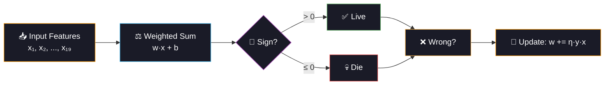

<div align="center">

<!-- ═══════════════════════════════════════════════════════════════ -->
<!-- 🦠 ANIMATED HEADER — HEPATITIS / LIVER / VIRUS THEME 🧬 -->
<!-- ═══════════════════════════════════════════════════════════════ -->


<!-- ═══════════════ ANIMATED TYPING ═══════════════ -->
<a href="https://git.io/typing-svg"></a>

<br/>

<!-- ═══════════════ BADGES ═══════════════ -->
[](https://python.org)
[](https://scikit-learn.org)
[](#)
[](#)

<br/>

[](#-key-learning-perceptron)
[](#-key-learning-roc-curve-analysis)
[](#-dataset)
[](#-youdens-j-statistic)

<br/>


</div>

<br/>

## 🦠 Project Overview

> **Predict hepatitis patient survival (Die vs Live) using the Perceptron — the simplest neural network — with a comprehensive deep-dive into ROC curve analysis: thresholds, AUC, Youden's J statistic, and bootstrap confidence intervals.**

This is the **bridge project** between classical ML (Days 1-8) and deep learning (Day 10+). The Perceptron is historically the first neural network (Rosenblatt, 1958) and understanding its limitations motivates everything that comes next. Meanwhile, ROC analysis is a critical skill for any medical ML practitioner — it answers "at what threshold should we actually deploy this model?"

<div align="center">

```
🦠 Hepatitis Patient Profile
════════════════════════════════════════════════════════

  👤 Demographics            🧬 Lab Results            🔬 Clinical Signs
  ────────────              ────────────              ──────────────
   Age                       Bilirubin                 Liver Big/Firm
   Sex                       Alk Phosphate             Spleen Palpable
                              SGOT (AST)                Spider Angiomas
  💊 Treatment                Albumin                   Ascites
  ────────────               Protime                   Varices
   Steroids                                             Histology
   Antivirals
                                    ↓
                              📈 ROC Analysis
                              ────────────
                               Threshold → 0.0 ──── 0.5 ──── 1.0
                               TPR       → 1.0 ──── ??? ──── 0.0
                               FPR       → 1.0 ──── ??? ──── 0.0
                               
                              🎯 "At what threshold do we
                                  maximize lives saved?"
```

</div>

<br/>

<div align="center">

</div>

<br/>

## ⚡ Key Learning: Perceptron

<div align="center">



</div>

### 🧠 Perceptron vs Other Models

| Property | Perceptron | Logistic Regression | MLP Neural Net |
|:---------|:-----------|:-------------------|:---------------|
| **Layers** | 1 (input → output) | 1 (with sigmoid) | 1+ hidden layers |
| **Decision boundary** | Linear hyperplane | Linear (with probs) | Non-linear |
| **Output** | Class label (no probability) | Calibrated probability | Probability |
| **Loss** | Hinge-like | Log loss (cross-entropy) | Cross-entropy |
| **Why Day 9?** | Foundation for all neural nets | Already done (Day 1) | Coming Day 10+ |

> **Key limitation:** Perceptron can ONLY learn linearly separable patterns. If Die/Live patients overlap in feature space, it fails. This motivates deep learning.

<br/>

<div align="center">

</div>

<br/>

## 📈 Key Learning: ROC Curve Analysis

### 📊 What IS a ROC Curve?

```
  TPR (Recall)
  1.0 ┤ ●──────────────╮
      │ ╱               │        Perfect model (AUC=1.0)
      │╱                │        hugs top-left corner
  0.8 ┤      ╱──────╮   │
      │     ╱        │   │
  0.6 ┤    ╱    Our  │   │
      │   ╱   Model  │   │
  0.4 ┤  ╱  (AUC≈0.8)│   │
      │ ╱             │   │
  0.2 ┤╱     Random ╱    │
      │    (AUC=0.5)╱     │
  0.0 ┼──────────────────┤
      0    0.2  0.4  0.6  0.8  1.0
                FPR
```

### 🎯 Four ROC Analyses Performed

| Analysis | What It Answers |
|:---------|:---------------|
| **Standard ROC** | Which model has the best discrimination ability? |
| **Threshold vs Metrics** | At what cutoff does F1 / Precision / Recall peak? |
| **Youden's J** | What's the statistically optimal operating point on the ROC? |
| **Bootstrap CI** | How confident are we in the AUC estimate? (critical for n=155!) |

### 📐 Youden's J Statistic

```
  J = Sensitivity + Specificity - 1 = TPR - FPR

  Interpretation:
  ┌─────────────────────────────────────────────────┐
  │  J = 1.0  → Perfect separation (never happens)  │
  │  J = 0.0  → No better than random               │
  │  J = 0.6  → Good clinical utility               │
  │                                                   │
  │  The threshold that MAXIMIZES J is the optimal    │
  │  operating point on the ROC curve.                │
  └─────────────────────────────────────────────────┘
```

### 🎲 Bootstrap Confidence Interval

```
  For n=155 (tiny dataset), a single AUC is unreliable.
  
  Bootstrap (500 resamples):
  1. Randomly sample 155 patients WITH replacement
  2. Compute AUC on this bootstrap sample  
  3. Repeat 500 times → distribution of AUCs
  4. 95% CI = [2.5th percentile, 97.5th percentile]
  
  If CI is wide (e.g., [0.60, 0.95]) → AUC is UNSTABLE
  If CI is narrow (e.g., [0.78, 0.88]) → AUC is RELIABLE
```

<br/>

<div align="center">

</div>

<br/>

## 📊 Dataset

| Property | Detail |
|:---------|:-------|
| **Source** | UCI Machine Learning Repository — Hepatitis |
| **Samples** | 155 patients (very small!) |
| **Features** | 19 (6 numeric + 13 binary clinical signs) |
| **Target** | Binary: Die (32, 20.6%) vs Live (123, 79.4%) |
| **Missing** | ~5% values — median imputation |
| **Challenge** | Tiny dataset + class imbalance + high dimensionality |

### 🔬 Feature Categories

```
  🧬 Liver Function Tests         💊 Treatment History
  ─────────────────────          ───────────────────
   Bilirubin  (↑ = bad)           Steroid therapy
   SGOT/AST   (↑ = damage)        Antiviral therapy
   Albumin    (↓ = bad)          
   Alk Phosphate                  🔍 Physical Exam
   Protime    (↓ = bad)          ──────────────
                                    Liver enlarged/firm
  👤 Patient Info                   Spleen palpable
  ────────────                     Spider angiomas
   Age (older = worse)             Ascites (fluid)
   Sex                             Varices (veins)
                                    Histology result
```

<br/>

## 🏗️ Project Structure

```
day09_hepatitis_diagnosis/
├── 📄 main.py                ← Entry point
├── 📄 config.py              ← Perceptron grid, threshold range, feature lists
├── 📄 data_pipeline.py       ← float32 data, efficient EDA, impute+scale
├── 📄 model_training.py      ← Perceptron + CalibratedClassifierCV + baselines
├── 📄 evaluation.py          ← ROC deep analysis (4 plots in 1 figure!)
├── 📄 README.md              ← You are here
├── 📁 data/                  ├── 📁 models/ (compressed joblib)
├── 📁 plots/                 ├── 📁 logs/
└── 📁 outputs/               ← Results CSV + report
```

<br/>

## ⚡ Quick Start

```bash
cd day09_hepatitis_diagnosis
python main.py
```

**Pipeline (4 phases, optimized):**
1. 🦠 Load UCI Hepatitis (155 patients, float32)
2. ⚡ Perceptron GridSearch (AUC-scored) + Platt calibration
3. 🧬 Train 4 baselines (LR, SVM, RF, MLP) with `n_jobs=-1`
4. 📈 ROC deep analysis (4-panel: curves, threshold, Youden's J, bootstrap CI)

<br/>

<div align="center">

</div>

<br/>

## 📈 Generated Visualizations

| # | Plot | What It Shows |
|:-:|:-----|:-------------|
| 01 | EDA Overview | Class dist + 5 key feature histograms by Die/Live |
| 02 | Correlation Heatmap | Numeric features vs survival correlation |
| 03 | Perceptron Weights | What the model learned (green=Live, red=Die) |
| 04 | **ROC Deep Analysis (4-panel)** | ROC curves, threshold vs metrics, Youden's J, bootstrap CI |
| 05 | Confusion Matrices | All 5 models side by side |
| 06 | Model Comparison | AUC + F1 + Accuracy bar chart |

<br/>

## 🔬 Models Compared

| Model | Role | Why Included |
|:------|:-----|:-------------|
| **🦠 Perceptron (Calibrated)** | Primary | Simplest neural net + ROC vehicle |
| Logistic Regression | Linear baseline | Calibrated probabilities (Perceptron doesn't have) |
| SVM (RBF) | Non-linear | Can Perceptron's linear boundary be beaten? |
| Random Forest | Tree ensemble | Handles feature interactions |
| MLP (1 hidden layer) | Deep learning preview | What adding 1 hidden layer does |

<br/>

## 🧠 Engineering Principles

```
✅ float32 dtype           → 50% memory reduction vs float64
✅ Compressed joblib       → Smaller model files (compress=3)
✅ n_jobs=-1 everywhere    → Parallel CV and model fitting
✅ Stratified 5-fold       → Appropriate for n=155 (not 10-fold)
✅ No data leakage         → Imputer + scaler fit on train only
✅ AUC as primary metric   → Threshold-independent evaluation
✅ Calibration             → CalibratedClassifierCV for Perceptron probs
✅ Bootstrap CI            → Honest uncertainty for small datasets
✅ Youden's J              → Statistically optimal threshold selection
```

<br/>

## 🩺 Clinical Significance

> **In hepatitis prognosis, a False Negative (predict "Live" but patient dies) is catastrophic — they miss aggressive treatment. A False Positive (predict "Die" but patient lives) leads to unnecessary but survivable intervention.**

The ROC analysis lets clinicians choose their own threshold based on their tolerance for FN vs FP. A transplant surgeon might set a low threshold (catch every possible death), while a primary care doctor might use a higher threshold (reduce false alarms).

<br/>

## 💡 Lessons Learned

| Lesson | Detail |
|:-------|:-------|
| **ROC > Accuracy** | AUC evaluates across ALL thresholds — single accuracy is misleading |
| **Threshold matters** | Default 0.5 is almost never optimal for medical data |
| **Youden's J** | Mathematically principled way to pick the "best" operating point |
| **Bootstrap for small n** | With 155 samples, point AUC is unreliable — CI is essential |
| **Perceptron's limit** | Linear boundary can't capture complex Die/Live patterns → need DL |
| **Calibration needed** | Perceptron outputs no probabilities — CalibratedClassifierCV fixes this |
| **Bridge to Day 10** | Perceptron = 0 hidden layers → MLP = 1+ hidden layers → CNN/DL |

<br/>

## 📦 Dependencies

```bash
numpy>=1.24
pandas>=2.0
scikit-learn>=1.3
matplotlib>=3.7
seaborn>=0.12
joblib>=1.3
```

<br/>

## 🔗 Part of 60 Days of ML & DL Challenge

<div align="center">

| Previous | Current | Next |
|:---------|:--------|:-----|
| [Day 8: Anemia Detection](../day08_anemia_detection/) | **🦠 Day 9: Hepatitis Diagnosis** | [Day 10: Malaria Classification](../day10_malaria_classification/) |
| AdaBoost + Outlier Removal | Perceptron + ROC Analysis | **Basic CNN — Entering Deep Learning!** |

</div>

<br/>

<div align="center">


<br/>
<br/>


<br/>

<a href="https://git.io/typing-svg"></a>

</div>
