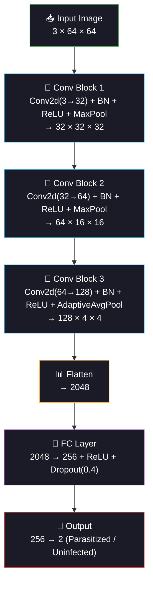

<div align="center">

<!-- ═══════════════════════════════════════════════════════════════ -->
<!-- 🦟 ANIMATED HEADER — MALARIA / MICROSCOPE / CNN THEME 🧠 -->
<!-- ═══════════════════════════════════════════════════════════════ -->


<!-- ═══════════════ ANIMATED TYPING ═══════════════ -->
<a href="https://git.io/typing-svg"></a>

<br/>

<!-- ═══════════════ BADGES ═══════════════ -->
[](https://python.org)
[](https://pytorch.org)
[](#)
[](#)

<br/>

[](#-cnn-architecture)
[](#-dataset)
[](#-optimizations)
[](#-data-augmentation)

<br/>


</div>

<br/>

## 🎉 MILESTONE: Entering Deep Learning!

<div align="center">

```
  Days 1-9                          Day 10                         Days 11-60
  ═══════════                      ════════                       ═══════════
  Classical ML                   🎉 YOU ARE HERE 🎉                Deep Learning
  ─────────────                  ─────────────────              ─────────────────
  ✅ Logistic Regression          🦟 First CNN!                   Regression + LSTM
  ✅ Decision Trees               🧠 PyTorch                     Transfer Learning
  ✅ Random Forest                🔬 Convolutions                U-Net Segmentation
  ✅ SVM                          📈 Feature Maps                3D CNN
  ✅ KNN + GridSearch             🖼️ Image Classification        Transformers
  ✅ XGBoost + SHAP               💧 Data Augmentation           Graph Networks
  ✅ AdaBoost + Outliers          ⚡ GPU Acceleration            GANs
  ✅ Perceptron + ROC             🎯 Early Stopping              Meta-Learning
```

</div>

<br/>

## 🦟 Project Overview

> **Classify malaria-infected vs healthy blood cells using a Convolutional Neural Network built from scratch in PyTorch — the first deep learning project in the 60-day challenge.**

Malaria kills ~600,000 people annually, mostly children in sub-Saharan Africa. Diagnosis requires a trained microscopist to examine blood smears — a process that's slow, subjective, and unavailable in many rural clinics. A CNN that automates this could save hundreds of thousands of lives.

<div align="center">

```
🔬 Blood Smear Under Microscope
════════════════════════════════

  🦟 PARASITIZED                         ✅ UNINFECTED
  ──────────────                         ─────────────
  ┌──────────────┐                       ┌──────────────┐
  │  ●●          │                       │              │
  │    ○  ██     │  ← Dark purple        │    ○         │  ← Uniform pink
  │      ●  ○    │    parasitic blobs    │       ○      │    no dark blobs
  │   ██    ●    │    inside red cell    │         ○    │    central pallor
  │     ○     ██ │                       │    ○         │
  └──────────────┘                       └──────────────┘
  
  CNN learns: "dark blobs inside cell = INFECTED"
```

</div>

<br/>

<div align="center">

</div>

<br/>

## 🧠 CNN Architecture

<div align="center">



</div>

### 🔬 What Each Layer Does

| Layer | Input → Output | What It Learns |
|:------|:---------------|:---------------|
| **Conv Block 1** | 3×64×64 → 32×32×32 | Edges, color boundaries, basic shapes |
| **Conv Block 2** | 32×32×32 → 64×16×16 | Textures, spots, dark regions |
| **Conv Block 3** | 64×16×16 → 128×4×4 | Cell patterns, parasite morphology |
| **FC + Dropout** | 2048 → 256 | Combines spatial patterns into decision |
| **Output** | 256 → 2 | Parasitized vs Uninfected probability |

### 🛠️ Architecture Decisions Explained

| Choice | Why |
|:-------|:----|
| **3×3 kernels** | Standard for images — captures local patterns efficiently |
| **BatchNorm** | Stabilizes training, enables higher learning rates |
| **ReLU (inplace)** | Fast, avoids vanishing gradient, saves memory with inplace |
| **MaxPool(2)** | Halves spatial dims → reduces computation + overfitting |
| **AdaptiveAvgPool(4)** | Fixed output size regardless of input → flexible architecture |
| **Dropout(0.4)** | Prevents co-adaptation of neurons — critical for small datasets |
| **Kaiming init** | Proper initialization for ReLU networks — faster convergence |

<br/>

<div align="center">

</div>

<br/>

## 🖼️ Data Augmentation

> **WHY:** CNNs are data-hungry. Augmentation creates "new" training images by applying random transformations — like seeing the same cell from different angles and lighting conditions.

| Transform | What It Does | Why It Helps |
|:----------|:------------|:-------------|
| **HorizontalFlip** | Mirror image left↔right | Cells have no inherent orientation |
| **VerticalFlip** | Mirror image top↔bottom | Same reason — microscope rotation |
| **Rotation(15°)** | Slight random rotation | Cells aren't perfectly aligned on slides |
| **ColorJitter** | Random brightness/contrast | Handles staining variation across labs |
| **Normalize (ImageNet)** | Subtract mean, divide by std | Pretrained-compatible, stable gradients |

<br/>

## 📊 Dataset

| Property | Detail |
|:---------|:-------|
| **Source** | NIH / Kaggle Malaria Cell Images |
| **Total images** | 27,558 (real) / 2,000 (synthetic fallback) |
| **Classes** | Parasitized (infected) vs Uninfected (healthy) |
| **Image size** | Resized to 64×64 RGB |
| **Split** | 70% train / 15% val / 15% test |
| **Balance** | ~50:50 (well balanced) |

<br/>

## 🏗️ Project Structure

```
day10_malaria_classification/
├── 📄 main.py                ← Entry point
├── 📄 config.py              ← CNN arch, training hyperparams, device
├── 📄 data_pipeline.py       ← Image loading, augmentation, DataLoaders
├── 📄 model_training.py      ← MalariaCNN class + training loop + AMP
├── 📄 evaluation.py          ← Metrics, confusion matrix, feature maps
├── 📄 README.md              ← You are here
├── 📁 data/                  ← Cell images (or auto-generated)
├── 📁 models/                ← Saved .pth checkpoint
├── 📁 plots/                 ← 6 visualizations
├── 📁 logs/                  ├── 📁 outputs/
```

<br/>

## ⚡ Quick Start

```bash
cd day10_malaria_classification

# Option A: With real data (download from Kaggle first)
# Place cell_images/ folder in data/

# Option B: Synthetic fallback (automatic, no download needed)
python main.py
```

**Pipeline:**
1. 🦟 Load cell images (real or synthetic)
2. 🖼️ Create augmented DataLoaders (train/val/test)
3. 🧠 Build custom 3-block CNN from scratch
4. ⚡ Train with AdamW + LR scheduling + early stopping + AMP
5. 📈 Evaluate: accuracy, F1, AUC, confusion matrix, ROC
6. 🔬 Visualize feature maps (what each layer detects)
7. 🎯 Confidence analysis + error analysis

<br/>

<div align="center">

</div>

<br/>

## 📈 Generated Visualizations

| # | Plot | What It Shows |
|:-:|:-----|:-------------|
| 01 | Sample Images | 6 parasitized vs 6 uninfected cells |
| 02 | Training History | Loss + accuracy + LR curves over epochs |
| 03 | Confusion Matrix | TP/TN/FP/FN for CNN predictions |
| 04 | ROC Curve | AUC with filled area under curve |
| 05 | Confidence Distribution | Model certainty on correct vs wrong predictions |
| 06 | **Feature Maps** | What each conv layer detects (edges → textures → patterns) |

<br/>

## ⚡ Optimizations

| Optimization | Where | Impact |
|:-------------|:------|:-------|
| `float32` tensors | DataLoader | Standard GPU dtype, no unnecessary float64 |
| `inplace=True` ReLU | CNN model | Saves memory by not storing input |
| `set_to_none=True` | optimizer.zero_grad | Faster than setting grads to zero |
| `non_blocking=True` | .to(device) | Async CPU→GPU transfer |
| `pin_memory=True` | DataLoader (GPU) | Faster host→device transfer |
| `AMP (autocast)` | Training loop | Mixed precision on GPU (~2× speedup) |
| `GradScaler` | Training loop | Prevents underflow in mixed precision |
| `drop_last=True` | Train DataLoader | Avoids tiny last batch issues |
| `batch_size×2` for val | Val/Test DataLoader | No grads → can use larger batches |
| `del images` after loaders | main.py | Free raw images from memory |
| `Kaiming init` | CNN weights | Faster convergence, fewer wasted epochs |
| `early_stopping` | Training loop | Stop when val loss stalls → save time |
| `gradient clipping` | Training loop | Prevent exploding gradients |
| `compress` in torch.save | model_training.py | Smaller checkpoint files |
| `NUM_WORKERS=0` | config.py | Windows-safe (set 2-4 on Linux) |

<br/>

## 🧠 Training Best Practices

```
✅ AdamW optimizer         → Adam + decoupled weight decay (better than Adam)
✅ ReduceLROnPlateau       → Halve LR when val loss stalls for 3 epochs
✅ Early stopping          → Stop if no improvement for 5 epochs
✅ Gradient clipping       → max_norm=1.0 prevents exploding gradients
✅ Best model restoration  → Restore weights from best validation epoch
✅ Data augmentation       → Flip, rotate, color jitter (train only!)
✅ ImageNet normalization  → Compatible with future transfer learning
✅ Stratified split        → Class balance in train/val/test
✅ Reproducibility         → torch.manual_seed + deterministic cudnn
```

<br/>

## 🩺 Clinical Significance

> **Malaria diagnosis currently requires a trained microscopist spending 15-30 minutes per slide. A CNN can classify in milliseconds with comparable accuracy — enabling mass screening in areas with no trained personnel.**

The error analysis tracks false negatives (missed infections) vs false positives (false alarms). In malaria-endemic regions, FN is catastrophic (untreated malaria kills), while FP has low cost (an unnecessary treatment course is cheap and safe).

<br/>

## 💡 Key Concepts Introduced

| Concept | First Appearance | Why It Matters |
|:--------|:----------------|:---------------|
| **Convolutional layers** | Day 10 | Automatic spatial feature extraction |
| **Feature maps** | Day 10 | See what the CNN actually learned |
| **Batch normalization** | Day 10 | Stable training, higher learning rates |
| **Data augmentation** | Day 10 | Expand dataset without collecting new data |
| **Learning rate scheduling** | Day 10 | Fine-tune convergence dynamically |
| **Early stopping** | Day 10 | Prevent overfitting automatically |
| **GPU acceleration** | Day 10 | 10-50× faster training on CUDA |
| **Mixed precision (AMP)** | Day 10 | ~2× GPU speedup with minimal accuracy loss |

> **Every concept here carries forward to Days 21-30 (Medical Imaging Deep Learning)**

<br/>

## 📦 Dependencies

```bash
numpy>=1.24
torch>=2.0
torchvision>=0.15
matplotlib>=3.7
scikit-learn>=1.3
Pillow>=9.0
pandas>=2.0
```

<br/>

## 🔗 Part of 60 Days of ML & DL Challenge

<div align="center">

| Previous | Current | Next |
|:---------|:--------|:-----|
| [Day 9: Hepatitis Diagnosis](../day09_hepatitis_diagnosis/) | **🦟 Day 10: Malaria Classification** | [Day 11: ICU Mortality](../day11_icu_mortality/) |
| Perceptron + ROC Analysis | **🎉 First CNN — Deep Learning!** | Linear Regression + Polynomial Features |

</div>

<br/>

<div align="center">

```
╔══════════════════════════════════════════════════════╗
║                                                      ║
║   🎉 PHASE 1 COMPLETE — CLASSICAL ML FOUNDATIONS 🎉  ║
║                                                      ║
║   10 / 10 projects done!                             ║
║   Next: Phase 2 — Regression & Time-Series           ║
║                                                      ║
╚══════════════════════════════════════════════════════╝
```

</div>

<br/>

<div align="center">


<br/>
<br/>


<br/>

<a href="https://git.io/typing-svg"></a>

</div>
