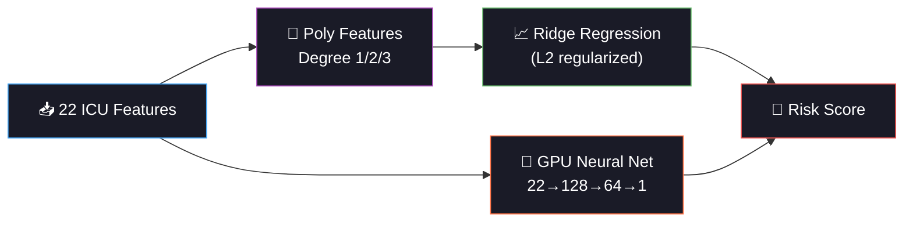

<div align="center">


<a href="https://git.io/typing-svg"></a>

<br/>

[](https://python.org)
[](https://pytorch.org)
[](https://scikit-learn.org)
[](#)

<br/>

[](#)
[](#)
[](#)
[](#)

<br/>


</div>

<br/>

## 🏥 Project Overview

> **Predict ICU patient mortality risk score from 22 clinical features using Polynomial Regression and a GPU-accelerated Neural Net — the first regression task in the 60-day challenge.**

Phase 2 shifts from **classification** (Days 1-10) to **regression** — predicting continuous values instead of categories. ICU mortality risk is a continuous score (0.0 = safe → 1.0 = critical), making it the perfect entry point for regression techniques.

<div align="center">

```
🏥 ICU Patient Data → 📈 Regression Models → 🎯 Risk Score (0.0 — 1.0)

  👤 Demographics        💉 Vitals              🧪 Labs
  ─────────────         ────────              ────────
   Age                   Heart Rate             BUN / Creatinine
   Prev ICU Stays        BP (Sys/Dia)           Sodium / Potassium
   LOS Before ICU        Resp Rate              Hemoglobin / WBC
                          Temperature            Platelets / Lactate
  🔧 Interventions       SpO₂ / GCS             PaO₂/FiO₂ ratio
  ─────────────         Urine Output
   Ventilator (Y/N)
   Vasopressor (Y/N)         ↓
                         📈 Mortality Risk
                         ═══════════════
                          0.0 ════════ 1.0
                          Safe        Critical
```

</div>

<br/>

<div align="center">

</div>

<br/>

## 📈 Key Learning: Polynomial Features

### 🔢 How Polynomial Features Work

```
Original features:    [age, lactate]

Degree 1 (Linear):   [age, lactate]                    → 2 features
Degree 2 (Quadratic): [age, lactate, age², age·lactate, lactate²]  → 5 features
Degree 3 (Cubic):    [...all above + age³, age²·lactate, ...]      → 9 features

With 22 original features:
  Degree 1 →     22 features
  Degree 2 →    275 features   (12× explosion!)
  Degree 3 →  2,324 features   (105× explosion! 💥)
```

### 🎯 Why This Matters

| Concept | Detail |
|:--------|:-------|
| **Linear regression can't curve** | y = w₁·age + w₂·lactate misses age² and age×lactate effects |
| **Poly features add curves** | y = w₁·age + w₂·lactate + w₃·age² + w₄·age·lactate captures nonlinearity |
| **Feature explosion** | 22 features → 2,324 at degree 3 — regularization (Ridge) is mandatory |
| **Overfitting risk** | More features than samples → model memorizes noise |
| **Sweet spot** | Usually degree 2 — captures interactions without explosion |

<br/>

<div align="center">

</div>

<br/>

## 📊 Regression Metrics Explained

> **Classification uses Accuracy/F1. Regression uses MAE/RMSE/R².**

| Metric | Formula | Interpretation |
|:-------|:--------|:---------------|
| **MAE** | mean(\|actual - predicted\|) | Average error magnitude. Easy to interpret. |
| **RMSE** | √mean((actual - predicted)²) | Penalizes large errors MORE than MAE |
| **R²** | 1 - SS_res/SS_total | % of variance explained (1.0 = perfect, 0.0 = useless) |
| **MSE** | mean((actual - predicted)²) | Raw squared error. Used as loss function. |

```
Example:
  Patient actual risk = 0.75
  Model predicts      = 0.68
  
  Error = |0.75 - 0.68| = 0.07     ← MAE contribution
  Error² = 0.07² = 0.0049          ← MSE contribution
  
  If another patient has error = 0.20:
  MAE contribution = 0.20           (2.9× the first)
  MSE contribution = 0.04           (8.2× the first! RMSE punishes more)
```

<br/>

<div align="center">

</div>

<br/>

## 🧠 Models

<div align="center">



</div>

| Model | Type | Features | Why |
|:------|:-----|:---------|:----|
| **Linear (Degree 1)** | Ridge Regression | 22 | Interpretable baseline |
| **Poly Degree 2** | Ridge + PolynomialFeatures | 275 | Captures interactions + quadratics |
| **Poly Degree 3** | Ridge + PolynomialFeatures | 2,324 | Tests feature explosion limits |
| **GPU Neural Net** | PyTorch 2-layer MLP | 22 (raw) | Learns nonlinearity automatically |

<br/>

## 📊 Dataset

| Property | Detail |
|:---------|:-------|
| **Inspired by** | MIMIC-IV ICU database |
| **Samples** | 4,200 ICU patients |
| **Features** | 22 (vitals, labs, demographics, interventions) |
| **Target** | Mortality risk score (continuous, 0.0 — 1.0) |
| **Nonlinearity** | Target includes interaction terms (age×lactate) + polynomial (age²) |
| **Noise** | Gaussian noise added for realism |

<br/>

## 🏗️ Project Structure

```
day11_icu_mortality/
├── 📄 main.py              ← Entry point
├── 📄 config.py             ← Poly degrees, NN arch, GPU device
├── 📄 data_pipeline.py      ← ICU data generation + preprocessing
├── 📄 model_training.py     ← Poly regression + GPU neural net
├── 📄 evaluation.py         ← Regression metrics, residuals, comparison
├── 📄 README.md
├── 📁 data/    ├── 📁 models/    ├── 📁 plots/
├── 📁 logs/    └── 📁 outputs/
```

<br/>

## ⚡ Quick Start

```bash
cd day11_icu_mortality
python main.py
```

**Pipeline:**
1. 🏥 Generate 4,200 ICU patients (22 features + nonlinear target)
2. 📊 EDA: target distribution + top correlated features
3. 🔢 Train Poly(1), Poly(2), Poly(3) Ridge regression with CV
4. 🧠 Train GPU neural net (128→64→1) with AMP + early stopping
5. 📈 Evaluate all: MAE, RMSE, R² + residual analysis
6. 🔬 Feature importance from linear regression coefficients

<br/>

<div align="center">

</div>

<br/>

## 📈 Generated Visualizations

| # | Plot | What It Shows |
|:-:|:-----|:-------------|
| 01 | EDA Overview | Target distribution + top 5 feature correlations |
| 02 | Poly Comparison | RMSE, R², feature count across degrees 1/2/3 |
| 03 | NN Training | Train vs val loss curves over epochs |
| 04 | Predictions | Actual vs predicted scatter + residual plots (4-panel) |
| 05 | Model Comparison | R² bar chart for all models |
| 06 | Coefficients | Linear regression weights (which features drive risk) |

<br/>

## ⚡ GPU Optimizations

| Optimization | Where | Impact |
|:-------------|:------|:-------|
| `float32` everywhere | data + model | Standard GPU dtype |
| `autocast` (AMP) | NN training + eval | Mixed precision on GPU |
| `GradScaler` | NN training | Prevents FP16 underflow |
| `set_to_none=True` | zero_grad | Faster than zeroing |
| `non_blocking=True` | .to(device) | Async transfer |
| `drop_last=True` | Train DataLoader | BatchNorm stability |
| `ReduceLROnPlateau` | Scheduler | Auto LR decay |
| Early stopping (patience=10) | Training loop | Save compute |
| `n_jobs=-1` | sklearn CV | Parallel CPU for poly models |
| `compress=3` joblib | Model saving | Smaller files |
| `rasterized=True` | Scatter plots | Smaller plot files |

<br/>

## 🩺 Clinical Significance

> **ICU mortality prediction scores help doctors triage patients — who needs the most aggressive intervention? A well-calibrated risk score (not just "high/low") enables proportional care allocation.**

The residual analysis reveals systematic prediction errors — e.g., if the model consistently under-predicts risk for elderly patients, that's a dangerous blind spot that needs fixing before deployment.

<br/>

## 💡 Lessons Learned

| Lesson | Detail |
|:-------|:-------|
| **Poly degree 2 sweet spot** | Captures interactions without massive feature explosion |
| **Ridge is mandatory** | Without L2 regularization, poly degree 3 overfits catastrophically |
| **Feature explosion** | 22 → 2,324 features at degree 3 — curse of dimensionality |
| **Neural nets skip poly** | MLP learns nonlinearity automatically — no manual feature engineering |
| **RMSE > MAE for safety** | In ICU, large errors are disproportionately dangerous |
| **Residual plots matter** | They reveal patterns that aggregate metrics (R²) hide |
| **GPU speeds up NN** | But sklearn poly regression is CPU-only (still fast at this scale) |

<br/>

## 📦 Dependencies

```bash
numpy>=1.24
torch>=2.0
scikit-learn>=1.3
matplotlib>=3.7
pandas>=2.0
joblib>=1.3
```

<br/>

## 🔗 Part of 60 Days of ML & DL Challenge

<div align="center">

| Previous | Current | Next |
|:---------|:--------|:-----|
| [Day 10: Malaria CNN](../day10_malaria_classification/) | **🏥 Day 11: ICU Mortality** | [Day 12: Blood Pressure](../day12_blood_pressure/) |
| 🎉 First CNN! | Polynomial Regression + GPU NN | Ridge Regression + Multicollinearity |

</div>

<br/>

<div align="center">

```
╔════════════════════════════════════════════════════╗
║                                                    ║
║   📈 PHASE 2: REGRESSION & TIME-SERIES             ║
║   Day 11 of 10 — Now predicting NUMBERS,           ║
║   not categories!                                   ║
║                                                    ║
╚════════════════════════════════════════════════════╝
```

</div>

<br/>

<div align="center">


<br/>
<br/>


<br/>

<a href="https://git.io/typing-svg"></a>

</div>
