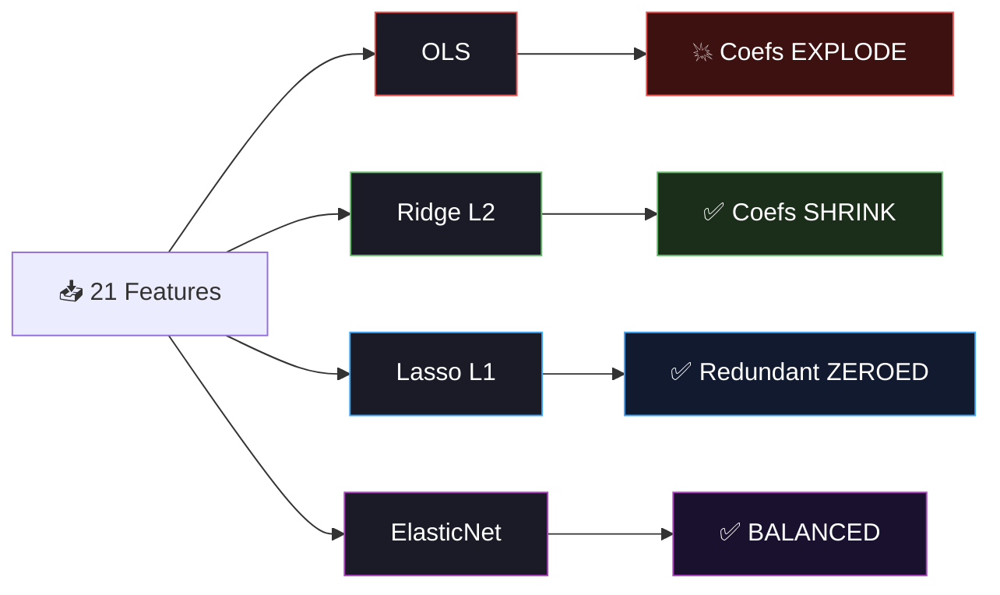

<div align="center">


<a href="https://git.io/typing-svg"></a>

<br/>

[](https://python.org)
[](https://pytorch.org)
[](https://scikit-learn.org)
[](#)

<br/>

[](#-chapter-2--the-investigation)
[](#%EF%B8%8F-chapter-3--the-showdown)
[](#-chapter-4--the-secret-weapon)
[](#-chapter-5--the-verdict)

<br/>


</div>

<br/>

## ❤️ The Story

> *Hypertension is called "the silent killer" — it has no symptoms until it's too late. 1.28 billion adults worldwide have high blood pressure, and only 1 in 5 have it under control. What if we could predict it before the damage is done?*

This project tells the story of building a blood pressure prediction system — and along the way, we discover a hidden enemy lurking inside our data: **multicollinearity**. It's a trap that breaks ordinary regression and inflates coefficients to nonsensical values. The journey to defeating it teaches us Ridge, Lasso, VIF analysis, and regularization paths.

<br/>

---

## 📖 Chapter 1 — The Data

<div align="center">

```
❤️ The Patient's Story (21 measurements → Blood Pressure)
════════════════════════════════════════════════════════════

  👤 WHO THEY ARE              💉 BLOOD LABS                  🏃 LIFESTYLE
  ─────────────               ─────────────                  ──────────
   Age                         Total Cholesterol               Exercise
   Weight / Height / BMI       LDL / HDL Cholesterol           Sleep
   Waist circumference         Triglycerides                   Stress (1-10)
   Heart rate                  Fasting Glucose                 Alcohol
                                Creatinine                      Smoking
  🧬 HISTORY                   Sodium / Potassium intake       Diabetes
   Family hypertension                                         
                                        ↓
                               ❤️ Systolic BP  (120-200 mmHg)
                               💙 Diastolic BP (60-120 mmHg)
```

</div>

**But hidden in these 21 features lies a trap...**

```
⚠️  THE MULTICOLLINEARITY TRAP:
    
    BMI = weight / height²     → BMI and weight contain the SAME information!
    LDL ⊂ Total Cholesterol    → LDL is literally a component of Total!
    Sodium ↔ Potassium         → Dietary pattern correlation
    
    When features duplicate information, OLS regression BREAKS.
    Coefficients become wildly unstable. Signs flip randomly.
    The model looks fine on RMSE... but the weights are MEANINGLESS.
```

<br/>

---

## 🔍 Chapter 2 — The Investigation

> *"We use the VIF diagnostic to identify the collinear culprits."*

### 🕵️ Variance Inflation Factor (VIF)

```
  VIF = 1 / (1 − R²ᵢ)

  where R²ᵢ = how well feature i is predicted by ALL other features

  ┌──────────────────────────────────────────────────┐
  │  VIF < 5      🟢 Independent — safe to use        │
  │  VIF 5-10     🟡 Moderate — proceed with caution   │
  │  VIF > 10     🔴 SEVERE — feature is redundant!    │
  └──────────────────────────────────────────────────┘

  Our investigation reveals:
    bmi               VIF ≈ 28   🔴  (derived from weight + height!)
    weight_kg          VIF ≈ 20   🔴  (correlated with bmi + waist)
    cholesterol_total  VIF ≈ 12   🔴  (LDL is its subset)
    waist_cm           VIF ≈ 10   🟡  (correlated with bmi)
    exercise_hours     VIF ≈  1   🟢  (independent — safe!)
```

<br/>

---

## ⚔️ Chapter 3 — The Showdown

> *"Four regression methods enter. Only the regularized survive."*

<div align="center">



</div>

| Method | What It Does | Multicollinearity Fix |
|:-------|:------------|:---------------------|
| **OLS** | Minimizes error, no constraints | None — coefficients explode |
| **Ridge (L2)** | Adds penalty on coefficient SIZE | Shrinks all coefs → stable |
| **Lasso (L1)** | Adds penalty on coefficient ABSOLUTE value | Zeros out redundant features |
| **ElasticNet** | L1 + L2 combined | Best of both worlds |

### 📉 The Regularization Path

```
Ridge α → 0.001     Large unstable coefficients (≈ OLS)
Ridge α → 1.0       Coefficients stabilize, shrink toward zero
Ridge α → 1000      All coefficients near zero (underfitting)

🎯 RidgeCV finds the sweet spot automatically
```

<br/>

---

## 🧠 Chapter 4 — The Secret Weapon

> *"The GPU neural net skips ALL feature engineering — learns both BP values at once."*

| Property | Value |
|:---------|:------|
| Architecture | 21 → 128 → 64 → 32 → **2** (systolic + diastolic) |
| Optimizer | AdamW + ReduceLROnPlateau |
| GPU Acceleration | AMP autocast + GradScaler |
| Regularization | Dropout + BatchNorm + Weight Decay |
| Early Stopping | patience=10 on validation loss |

The dual-output design learns **shared representations** — features that predict systolic also help predict diastolic, so one model is better than two.

<br/>

---

## 📊 Chapter 5 — The Verdict

### 📈 7 Visualizations Tell the Full Story

| # | Plot | The Story It Tells |
|:-:|:-----|:------------------|
| 01 | Target Distributions | Systolic + Diastolic + their strong correlation |
| 02 | **Multicollinearity Heatmap** | The crime scene — collinear pairs highlighted green |
| 03 | **VIF Bar Chart** | The lineup — guilty features flagged red (VIF > 10) |
| 04 | **Coefficient Comparison** | OLS coefficients EXPLODE vs Ridge/Lasso stability |
| 05 | NN Training Curves | GPU neural net convergence |
| 06 | **6-Panel Analysis** | Actual vs predicted + residuals + Bland-Altman + error dist |
| 07 | **Regularization Path** | How coefficients shrink as Ridge α increases |

### 📐 Bland-Altman Plot

> The clinical gold standard for comparing measurement methods. Shows **agreement** between actual and predicted at every pressure level — reveals systematic bias that R² alone hides.

<br/>

---

## 🏗️ Project Structure

```
day12_blood_pressure/
├── 📄 main.py              ← Entry point
├── 📄 config.py             ← Features, Ridge alphas, NN arch
├── 📄 data_pipeline.py      ← Deliberate multicollinearity + VIF analysis
├── 📄 model_training.py     ← OLS/Ridge/Lasso showdown + GPU dual-output NN
├── 📄 evaluation.py         ← Metrics + Bland-Altman + regularization path
├── 📄 README.md
├── 📁 plots/ (7 visualizations)
├── 📁 models/ ├── 📁 logs/ └── 📁 outputs/
```

<br/>

## ⚡ Quick Start

```bash
cd day12_blood_pressure
python main.py
```

**The journey:**
1. ❤️ Generate 5,000 patients with deliberately correlated features
2. 🔍 VIF analysis — expose multicollinearity
3. ⚔️ Regression showdown: OLS vs Ridge vs Lasso vs ElasticNet
4. 🧠 GPU neural net — dual output (systolic + diastolic in one pass)
5. 📊 7 plots: multicollinearity heatmap, VIF, coefficient comparison, Bland-Altman

<br/>

## ⚡ Optimizations

| Optimization | Impact |
|:-------------|:-------|
| `float32` all data | 50% memory vs float64 |
| GPU AMP | ~2× faster NN training |
| Dual-output NN | One model for both targets |
| `n_jobs=-1` | Parallel CV for all sklearn models |
| `rasterized=True` scatter | 10× smaller plot files |
| Vectorized VIF (numpy lstsq) | No statsmodels dependency |

<br/>

## 📦 Tech Stack

```bash
numpy>=1.24       # Vectorized computation
torch>=2.0        # GPU neural net
scikit-learn>=1.3  # Ridge, Lasso, ElasticNet, RidgeCV
matplotlib>=3.7    # All visualizations
seaborn>=0.12      # Correlation heatmap
pandas>=2.0        # Results export
joblib>=1.3        # Model serialization
```

<br/>

## 🔗 60 Days of ML & DL Challenge

<div align="center">

| Previous | Current | Next |
|:---------|:--------|:-----|
| [Day 11: ICU Mortality](../day11_icu_mortality/) | **❤️ Day 12: Blood Pressure** | [Day 13: COVID Forecasting](../day13_covid_forecasting/) |
| Polynomial Features | Ridge + Multicollinearity | ARIMA Time-Series |

</div>

<br/>

<div align="center">


<br/><br/>


<br/>

<a href="https://git.io/typing-svg"></a>

</div>
