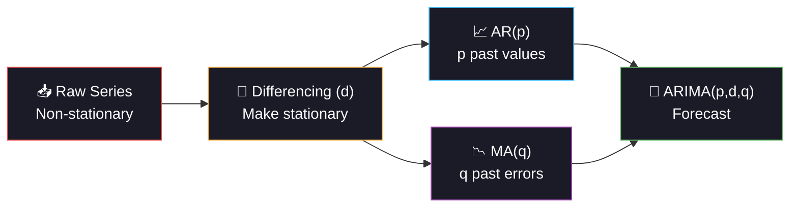

<div align="center">


<a href="https://git.io/typing-svg"></a>

<br/>

[](https://python.org)
[](https://pytorch.org)
[](https://statsmodels.org)
[](#)

<br/>

[](#)
[](#-chapter-2-arima)
[](#-chapter-4-the-deep-learning-challenger)
[](#-chapter-3-exponential-smoothing)

<br/>


</div>

<br/>

---

## 📖 The Story of Day 13

*March 2020. A new virus is sweeping the globe. Hospitals need to know: how many cases will we see next week? Next month? Today, we build the model that answers that question.*

---

<br/>

## 🦠 Prologue: The Pandemic Timeline

<div align="center">

```
Daily Cases
20K ┤                                              ╭──╮    Wave 3
    │                                             ╱    ╲   (Omicron)
15K ┤                          ╭──╮              ╱      ╲
    │                         ╱    ╲  Wave 2    ╱        ╲
10K ┤                        ╱      ╲          ╱          ╲
    │     ╭──╮              ╱        ╲        ╱            ╲
 5K ┤    ╱    ╲  Wave 1    ╱          ╲──────╱              ╲────
    │───╱      ╲──────────╱                                      ╲───
  0 ┼──────────────────────────────────────────────────────────────────
    Mar    Jun    Sep    Dec    Mar    Jun    Sep    Dec    Mar
    2020   2020   2020   2020   2021   2021   2021   2021   2022

    ├────────── TRAIN (80%) ──────────┤├───── TEST (20%) ─────┤
                                      ↑
                               Forecast starts here
```

</div>

> **The challenge:** given 584 days of history, predict the next 146 days. Three models compete: classical ARIMA, Holt-Winters smoothing, and a GPU-accelerated LSTM neural network.

<br/>

<div align="center">

</div>

<br/>

## 🕐 Chapter 1: Why Time-Series is Different

> On Day 1, we shuffled data randomly. **Today, that would be a fatal mistake.**

```
❌ WRONG — Random Split (what we did for classification)
  ┌─────────────────────────────────────────────────┐
  │ ■ □ ■ □ ■ ■ □ ■ □ ■   (randomly mixed)         │
  │ This LEAKS future data into training!            │
  │ The model "sees" Wave 3 while predicting Wave 2  │
  └─────────────────────────────────────────────────┘

✅ RIGHT — Temporal Split (what we do today)
  ┌─────────────────────────────────────────────────┐
  │ ■ ■ ■ ■ ■ ■ ■ ■ | □ □ □ □   (ordered by time)  │
  │ Train on past ────┤ Predict future               │
  │ Model NEVER sees the future during training      │
  └─────────────────────────────────────────────────┘
```

### 🔑 Time-Series Rules

| Rule | Why |
|:-----|:----|
| **Never shuffle** | Temporal order IS the information |
| **Temporal split only** | Train on past, test on future |
| **Stationarity matters** | Most models need constant mean/variance over time |
| **Seasonality is real** | COVID has weekly patterns (fewer weekend reports) |
| **Forecast degrades** | Day 1 forecast >> Day 30 forecast (error accumulates) |

<br/>

<div align="center">

</div>

<br/>

## 📊 Chapter 2: ARIMA — The Classical Hero

<div align="center">



</div>

### 🔢 ARIMA(p, d, q) Decoded

```
ARIMA = Auto-Regressive Integrated Moving Average

  A.R. (p=2):  today ≈ 0.6 × yesterday + 0.3 × day_before
               "The recent past predicts the present"

  I.   (d=1):  instead of raw cases, model the CHANGE in cases
               "Remove the trend so the model sees patterns, not drift"

  M.A. (q=1):  today ≈ yesterday's prediction + 0.4 × yesterday's error
               "Learn from mistakes"

Grid search tests ALL (p,d,q) combinations → picks lowest AIC.
```

<br/>

## 📈 Chapter 3: Exponential Smoothing

> Holt-Winters decomposes the series into **trend + seasonality + residual** and forecasts each separately.

```
COVID Daily Cases = Trend Component + Weekly Seasonal + Random Noise

  Trend:     ──────╱╲────╱╲──────╲──    (the wave shapes)
  Seasonal:  ╱╲╱╲╱╲╱╲╱╲╱╲╱╲╱╲╱╲╱╲     (weekly cycle, period=7)
  Residual:  ~~~~~~~~~~~~~~~~~~~~        (unpredictable noise)

  Forecast = Extrapolated Trend + Repeated Seasonal Pattern
```

<br/>

<div align="center">

</div>

<br/>

## 🧠 Chapter 4: The Deep Learning Challenger — GPU LSTM

> "ARIMA assumes linear relationships. What if the pandemic dynamics are nonlinear?"

```
LSTM Memory Cell — Learns WHAT to remember and WHAT to forget

  ┌─────────────────────────────────────────────────┐
  │                                                 │
  │   Forget Gate: "Is last week still relevant?"   │
  │        ↓                                        │
  │   Input Gate:  "What's new and important?"      │
  │        ↓                                        │
  │   Cell State:  Long-term memory (weeks/months)  │
  │        ↓                                        │
  │   Output Gate: "What should I predict today?"   │
  │                                                 │
  └─────────────────────────────────────────────────┘

  Input: last 21 days of cases (sliding window)
  Output: predicted cases for tomorrow
  Architecture: LSTM(64 hidden, 2 layers) → Linear(1)
  Training: GPU with AMP, AdamW, early stopping
```

<br/>

## ⚔️ Chapter 5: The Three-Way Battle

| | ARIMA | Exp Smoothing | GPU LSTM |
|:---|:---|:---|:---|
| **Type** | Statistical | Statistical | Neural network |
| **Captures trend?** | ✅ via differencing | ✅ via trend component | ✅ learned implicitly |
| **Captures seasonality?** | ❌ basic ARIMA doesn't | ✅ explicit seasonal component | ✅ if enough data |
| **Nonlinear patterns?** | ❌ linear only | ❌ linear | ✅ arbitrary functions |
| **Needs lots of data?** | ❌ works with ~100 points | ❌ works with ~100 | ✅ needs 500+ ideally |
| **Interpretable?** | ✅ (p,d,q) are meaningful | ✅ trend/seasonal/residual | ❌ black box |
| **Speed** | ⚡ seconds | ⚡ seconds | 🧠 30-60s on GPU |

<br/>

<div align="center">

</div>

<br/>

## 📊 Chapter 6: The Data

| Property | Detail |
|:---------|:-------|
| **Period** | March 2020 → March 2022 (730 days) |
| **Frequency** | Daily |
| **Waves** | 3 epidemic waves + decline (realistic dynamics) |
| **Seasonality** | Weekly (fewer weekend reports) |
| **Train/Test** | 80% / 20% (temporal split — no shuffling!) |
| **Forecast horizon** | 146 days (full test set) + 30-day zoom analysis |

<br/>

## 🏗️ Project Structure

```
day13_covid_forecasting/
├── 📄 main.py              ← Entry point
├── 📄 config.py             ← ARIMA ranges, LSTM arch, lookback window
├── 📄 data_pipeline.py      ← Synthetic pandemic waves + LSTM windowing
├── 📄 model_training.py     ← ARIMA grid search + ETS + GPU LSTM
├── 📄 evaluation.py         ← MAE/RMSE/MAPE + forecast plots
├── 📄 README.md
├── 📁 data/    ├── 📁 models/    ├── 📁 plots/
├── 📁 logs/    └── 📁 outputs/
```

<br/>

## ⚡ Quick Start

```bash
# Install time-series dependencies
pip install statsmodels torch torchvision

cd day13_covid_forecasting
python main.py
```

**Pipeline:**
1. 🦠 Generate 730 days of pandemic data (3 waves + weekly seasonality)
2. 📊 EDA: full timeline, 7-day MA, weekly seasonality analysis
3. 📈 ARIMA grid search across all (p,d,q) combos → best AIC
4. 📈 Holt-Winters exponential smoothing (trend + seasonal)
5. 🧠 GPU LSTM (21-day lookback → next day, AMP training)
6. 📊 Evaluate: MAE, RMSE, MAPE + forecast overlay + zoomed 30-day view

<br/>

<div align="center">

</div>

<br/>

## 📈 Chapter 7: The Visualizations

| # | Plot | The Story It Tells |
|:-:|:-----|:------------------|
| 01 | **Full Timeline** | 🦠 The entire pandemic: 3 waves, train/test split, weekly pattern |
| 02 | LSTM Training | 🧠 Loss curves — did the neural net converge? |
| 03 | **Forecast Overlay** | ⚔️ All 3 models vs actual — who predicted best? |
| 04 | Metric Comparison | 🏆 MAE, RMSE, MAPE bar charts side by side |
| 05 | **30-Day Zoom** | 🔍 Close-up of near-term forecast accuracy |

<br/>

## ⚡ Tech Stack & Optimizations

| Tech | Role |
|:-----|:-----|
| `statsmodels` | ARIMA + Exponential Smoothing |
| `PyTorch` + `CUDA` | GPU LSTM with AMP |
| `scikit-learn` | MinMaxScaler for LSTM data |
| `pandas` | Time-series indexing + rolling averages |

| Optimization | Impact |
|:-------------|:-------|
| `float32` everywhere | 50% memory vs float64 |
| `AMP autocast + GradScaler` | ~2× GPU speedup for LSTM |
| ARIMA AIC-based search | Finds best (p,d,q) without testing on future data |
| Sliding window vectorized | Efficient LSTM data prep, no Python loops |
| `ReduceLROnPlateau` + early stopping | No wasted GPU epochs |
| `MinMaxScaler` for LSTM | Neural nets train better on [0,1] scaled data |
| `rasterized=True` scatter | Smaller plot files |

<br/>

## 📏 Time-Series Metrics Explained

| Metric | Formula | When to Use |
|:-------|:--------|:------------|
| **MAE** | mean(\|actual - predicted\|) | Easy to interpret: "off by ~X cases/day" |
| **RMSE** | √mean((actual - predicted)²) | Penalizes big misses harder |
| **MAPE** | mean(\|error/actual\|) × 100% | "We're off by ~X%" — best for stakeholders |

<br/>

## 💡 Chapter 8: The Moral

| Lesson | Detail |
|:-------|:-------|
| **Never shuffle time-series** | Temporal order IS the signal — shuffling = data leakage |
| **ARIMA is powerful + simple** | With the right (p,d,q), it beats many complex models |
| **Stationarity is key** | Differencing (d=1 or 2) removes trends ARIMA can't handle |
| **Weekly seasonality is real** | COVID reports drop on weekends — ETS models this explicitly |
| **LSTM captures nonlinearity** | But needs more data and GPU compute |
| **Forecast degrades with horizon** | Day 1 prediction >> Day 30 prediction |
| **MAPE for communication** | Doctors understand "off by 15%" better than "RMSE = 1,247" |
| **This is Day 1 of time-series** | Days 14-20 go deeper: LSTM, ARIMA variants, more |

<br/>

## 📦 Dependencies

```bash
numpy>=1.24
pandas>=2.0
torch>=2.0
statsmodels>=0.14
scikit-learn>=1.3
matplotlib>=3.7
joblib>=1.3
```

<br/>

## 🔗 Part of 60 Days of ML & DL Challenge

<div align="center">

| Previous | Current | Next |
|:---------|:--------|:-----|
| [Day 12: Blood Pressure](../day12_blood_pressure/) | **🦠 Day 13: COVID Forecasting** | [Day 14: Drug Response](../day14_drug_response/) |
| Ridge + Multicollinearity | ARIMA + ETS + GPU LSTM | Lasso + TF-IDF Text Features |

</div>

<br/>

<div align="center">


<br/>
<br/>


<br/>

<a href="https://git.io/typing-svg"></a>

</div>
