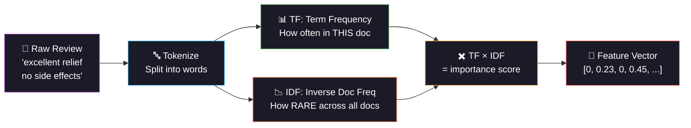

<div align="center">


<a href="https://git.io/typing-svg"></a>

<br/>

[](https://python.org)
[](https://pytorch.org)
[](https://scikit-learn.org)
[](#)

<br/>

[](#)
[](#-chapter-3-the-surgeon)
[](#-chapter-2-the-translator)
[](#-chapter-4-the-deep-learning-alternative)

<br/>


</div>

<br/>

---

## 📖 The Story of Day 14

*A patient writes: "This medication was a life-changer. My migraines disappeared within a week." Another writes: "Terrible side effects. Nausea, dizziness, had to discontinue." Can a machine read these reviews and predict the rating?*

---

<br/>

## 💊 Prologue: The Challenge

> 6,000 drug reviews. Raw text. Messy, emotional, full of medical jargon. And we need to predict a number (1-10 rating) from these words.

<div align="center">

```
📝 Patient Review                                    🎯 Rating
════════════════                                    ═══════
"This medication was excellent.                       9/10 ⭐
 My chronic pain is finally
 manageable. Highly recommend."
                                                      
"Terrible experience. Severe                          2/10
 nausea and headaches. Had to
 stop after one week."

"It works okay. Some minor                            6/10
 side effects but tolerable.
 Better than nothing."

         ↓                                              ↓
   📝 Raw Text                                    💊 How do we
   (unstructured)                                  get from
                                                   WORDS → NUMBER?
                              
         ↓ TF-IDF ↓
                              
   🔢 5,000 numerical features                         ↓
   (one per important word/phrase)               
                                                  📈 Lasso Regression
         ↓                                        selects the words
                                                  that ACTUALLY predict
   🎯 Rating = Σ(word_weight × word_importance)   the rating
```

</div>

<br/>

<div align="center">

</div>

<br/>

## 🔤 Chapter 1: The Problem — Text is Not Numbers

> Machine learning models eat numbers. Reviews are words. We need a translator.

```
The model sees:     "excellent relief life-changing no side effects"
The model needs:    [0.00, 0.00, 0.23, 0.00, 0.45, ..., 0.31, 0.00, 0.18]
                     ↑ 5,000 numbers, one per word/phrase in vocabulary

This translation is called FEATURE EXTRACTION.
```

<br/>

## 📝 Chapter 2: The Translator — TF-IDF

<div align="center">



</div>

### 🧮 TF-IDF in Plain English

```
TF (Term Frequency):
  "excellent" appears 2 times in a 50-word review
  TF = 2/50 = 0.04

IDF (Inverse Document Frequency):
  "excellent" appears in 200 out of 6,000 reviews
  IDF = log(6000/200) = 3.40
  
  "the" appears in 5,900 out of 6,000 reviews
  IDF = log(6000/5900) = 0.02  ← basically zero (useless word!)

TF-IDF = TF × IDF:
  "excellent": 0.04 × 3.40 = 0.136  ← meaningful signal ✅
  "the":       0.06 × 0.02 = 0.001  ← noise, filtered out ❌
```

### 🔑 Our TF-IDF Configuration

| Setting | Value | Why |
|:--------|:------|:----|
| `max_features` | 5,000 | Keep top 5K most informative words |
| `ngram_range` | (1, 2) | Unigrams + bigrams ("side effects" as one feature!) |
| `min_df` | 3 | Ignore words appearing < 3 times (typos, gibberish) |
| `max_df` | 0.95 | Ignore words in > 95% of docs ("the", "a", "is") |

> **Key insight:** bigrams like "side effects", "no improvement", "life changing" carry MORE meaning than individual words!

<br/>

<div align="center">

</div>

<br/>

## 🔪 Chapter 3: The Surgeon — Lasso Regression

> We have 5,000 TF-IDF features. Most are noise. Lasso's job: **cut the irrelevant ones to exactly zero.**

```
5,000 TF-IDF features enter Lasso...

  "excellent"     →  coef = +0.42   ✅ KEPT (strong positive signal)
  "terrible"      →  coef = -0.38   ✅ KEPT (strong negative signal)
  "side effects"  →  coef = -0.25   ✅ KEPT (predicts lower rating)
  "recommend"     →  coef = +0.31   ✅ KEPT
  "the"           →  coef =  0.00   🔪 ZEROED OUT
  "medication"    →  coef =  0.00   🔪 ZEROED OUT (appears everywhere)
  "daily"         →  coef =  0.00   🔪 ZEROED OUT (no predictive power)
  ...
  
  Result: 5,000 features → ~200-500 survive (95% eliminated!)
  
  This IS feature selection. Lasso does it automatically.
```

### 📊 Lasso vs Ridge vs ElasticNet

| | Lasso (L1) | Ridge (L2) | ElasticNet (L1+L2) |
|:---|:---|:---|:---|
| **Penalty** | α × Σ\|w\| | α × Σw² | α₁ × Σ\|w\| + α₂ × Σw² |
| **Effect** | Zeros out features | Shrinks all evenly | Mix of both |
| **Best for** | Feature selection | Multicollinearity | Correlated groups |
| **Day 14** | ⭐ Primary model | Baseline | Baseline |
| **Interpretable?** | ✅ "These 200 words matter" | ✅ All features kept | ✅ Some zeroed |

<br/>

<div align="center">

</div>

<br/>

## 🧠 Chapter 4: The Deep Learning Alternative

> Neural net doesn't need TF-IDF feature selection — it learns word importance implicitly. But it's a black box.

```
GPU Neural Net Architecture:
  TF-IDF(5000) + Numeric(5)
       ↓
  Linear(5005 → 256) + BN + ReLU + Dropout(0.4)
       ↓
  Linear(256 → 128) + BN + ReLU + Dropout(0.3)
       ↓
  Linear(128 → 1) → Rating prediction
  
  Trained on GPU with AMP, AdamW, early stopping
```

| | Lasso | GPU Neural Net |
|:---|:---|:---|
| **Feature selection** | ✅ Explicit (zeros out words) | ❌ Implicit (hidden weights) |
| **Interpretable** | ✅ "excellent = +0.42 rating" | ❌ Black box |
| **Nonlinear** | ❌ Linear only | ✅ Captures word interactions |
| **Speed** | ⚡ 2 seconds | 🧠 30-60s on GPU |
| **Doctor-friendly** | ✅ "Show me which words" | ❌ "Trust the number" |

<br/>

<div align="center">

</div>

<br/>

## 📊 Chapter 5: The Data

| Property | Detail |
|:---------|:-------|
| **Source** | Simulated drug review dataset (based on UCI Drug Review) |
| **Reviews** | 6,000 patient reviews |
| **Drugs** | 25 unique medications |
| **Conditions** | 20 medical conditions |
| **Target** | Rating (1-10 integer scale) |
| **Text features** | 5,000 TF-IDF (unigrams + bigrams) |
| **Numeric features** | 5 (useful count, review length, word count, condition/drug frequency) |

<br/>

## 🏗️ Project Structure

```
day14_drug_response/
├── 📄 main.py              ← Entry point
├── 📄 config.py             ← TF-IDF settings, Lasso alphas, NN arch
├── 📄 data_pipeline.py      ← Review generation + TF-IDF extraction + EDA
├── 📄 model_training.py     ← Lasso sweep + Ridge/ElasticNet + GPU NN
├── 📄 evaluation.py         ← Metrics + Lasso feature analysis + plots
├── 📄 README.md
├── 📁 data/    ├── 📁 models/    ├── 📁 plots/
├── 📁 logs/    └── 📁 outputs/
```

<br/>

## ⚡ Quick Start

```bash
cd day14_drug_response
python main.py
```

**Pipeline:**
1. 💊 Generate 6,000 drug reviews with correlated sentiment-rating
2. 📊 EDA: rating distribution, top drugs/conditions, review length analysis
3. 📝 TF-IDF extraction (5,000 features, fit on train only!)
4. 🔪 Lasso α sweep: watch features get eliminated as α increases
5. 📈 Train Ridge + ElasticNet baselines
6. 🧠 Train GPU neural net (5,005 → 256 → 128 → 1)
7. 📊 Evaluate + show which words Lasso selected + top positive/negative words

<br/>

<div align="center">

</div>

<br/>

## 📈 Chapter 6: The Visualizations

| # | Plot | The Story It Tells |
|:-:|:-----|:------------------|
| 01 | EDA | 💊 Rating distribution, top drugs/conditions, review length vs rating |
| 02 | **TF-IDF Features** | 📝 Top 30 words + their correlation with rating (green=positive, red=negative) |
| 03 | **Lasso Sweep** | 🔪 RMSE vs α + features surviving vs α + sparsity % |
| 04 | NN Training | 🧠 Loss curves with early stopping |
| 05 | Predictions | 📈 Actual vs predicted scatter (Lasso vs NN) |
| 06 | Comparison | 🏆 All models ranked by R² and RMSE |

<br/>

## ⚡ Tech Stack & Optimizations

| Tech | Role |
|:-----|:-----|
| `scikit-learn` | TF-IDF vectorizer, Lasso/Ridge/ElasticNet |
| `scipy.sparse` | Sparse matrix storage for TF-IDF (memory-efficient!) |
| `PyTorch + CUDA` | GPU neural net with AMP |

| Optimization | Impact |
|:-------------|:-------|
| **Sparse matrices** | 5000×6000 dense = 120MB. Sparse = ~5MB (96% zeros!) |
| `float32` dtype in TF-IDF | Half the memory vs default float64 |
| `min_df=3, max_df=0.95` | Pre-filter useless words before training |
| `n_jobs=-1` for sklearn | Parallel Lasso CV across 5 folds |
| `AMP autocast` | Mixed precision GPU training |
| `del df` after extraction | Free raw DataFrame memory |
| `compress=3` joblib | Smaller saved TF-IDF model |
| Early stopping (patience=8) | No wasted GPU epochs |

<br/>

## 💡 Chapter 7: The Moral

| Lesson | Detail |
|:-------|:-------|
| **TF-IDF = words → numbers** | The simplest text-to-features method that actually works |
| **Bigrams > unigrams** | "no improvement" ≠ "no" + "improvement" |
| **Lasso = automatic feature selection** | 5,000 features → ~300 that matter |
| **Sparse storage is critical** | Most TF-IDF cells are zero — sparse matrices save 95% memory |
| **Fit TF-IDF on train only** | Test vocabulary leaking into training = data leakage |
| **Positive words ↔ high rating** | "excellent", "relief", "recommend" → +coefficient |
| **Negative words ↔ low rating** | "terrible", "nausea", "discontinued" → -coefficient |
| **NN captures interactions** | "no" + "side effects" together = positive, but individually not |

<br/>

## 📦 Dependencies

```bash
numpy>=1.24
pandas>=2.0
torch>=2.0
scikit-learn>=1.3
scipy>=1.10
matplotlib>=3.7
joblib>=1.3
```

<br/>

## 🔗 Part of 60 Days of ML & DL Challenge

<div align="center">

| Previous | Current | Next |
|:---------|:--------|:-----|
| [Day 13: COVID Forecasting](../day13_covid_forecasting/) | **💊 Day 14: Drug Response** | [Day 15: BMI Prediction](../day15_bmi_prediction/) |
| ARIMA + ETS + LSTM | Lasso + TF-IDF + GPU NN | RF Regressor + Interaction Terms |

</div>

<br/>

<div align="center">


<br/>
<br/>


<br/>

<a href="https://git.io/typing-svg"></a>

</div>
