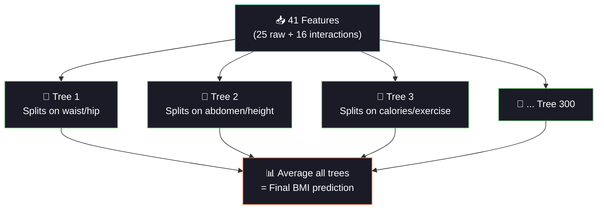

<div align="center">


<a href="https://git.io/typing-svg"></a>

<br/>

[](https://python.org)
[](https://pytorch.org)
[](https://scikit-learn.org)
[](#)

<br/>

[](#-chapter-3-the-forest)
[](#-chapter-2-the-blacksmith)
[](#-chapter-4-the-challenger)
[](#-chapter-5-the-clinical-test)

<br/>


</div>

<br/>

---

## 📖 The Story of Day 15

*A tape measure, a scale, and a blood test walk into a machine learning model. The question: can they predict your BMI better than the formula weight/height² — by understanding how body measurements INTERACT with each other?*

---

<br/>

## ⚖️ Chapter 1: The Mission

> BMI = weight / height². Simple math. But what if we don't have reliable weight and height? What if we only have body measurements — waist, hip, chest, neck circumference — from a rural clinic with just a tape measure?

We have **5,500 patients** with 25 body measurements, lifestyle features, and dietary data. The challenge: predict BMI from the **relationships between features** — not just individual values.

<div align="center">

```
⚖️ BMI Scale
═══════════════════════════════════════════════════════
       15        18.5        25         30        35        50
        │          │          │          │         │         │
        ├──────────┼──────────┼──────────┼─────────┼─────────┤
        │Underweight│  Normal  │Overweight│ Obese I │Obese II+│
        │  🔵       │  🟢     │  🟡      │  🟠     │  🔴     │
        └──────────┴──────────┴──────────┴─────────┴─────────┘

📏 Body Measurements          🍽️ Lifestyle              📊 Target
─────────────────             ─────────                ─────────
 Waist / Hip / Neck            Calories / Macros         BMI
 Chest / Abdomen               Exercise hrs/wk           (kg/m²)
 Thigh / Knee / Ankle          Sleep / Sedentary
 Bicep / Forearm / Wrist       Water / Alcohol / Smoking
```

</div>

<br/>

<div align="center">

</div>

<br/>

## 🔧 Chapter 2: The Blacksmith — Interaction Feature Engineering

> Individual features are raw metal. Interaction terms are the forged sword. A 90cm waist means nothing without knowing the hip measurement. But **waist/hip ratio** = clinical gold.

### 🧮 What Are Interaction Terms?

```
RAW FEATURES:        waist_cm = 95        hip_cm = 100

INTERACTION TERMS:
  Ratio:    waist/hip     = 95/100 = 0.95   ← Clinical WHR (obesity marker!)
  Product:  waist × hip   = 9,500           ← Body area approximation

WHY THIS MATTERS:
  waist = 95  could be:  tall thin person  → BMI = 22
  waist = 95  could be:  short stocky person → BMI = 32
  
  But waist/height = 95/180 = 0.53 → Normal
      waist/height = 95/155 = 0.61 → Obese!
      
  The RATIO tells the story that raw values can't.
```

### 🔩 8 Engineered Interaction Pairs

| Pair | Ratio Meaning | Product Meaning |
|:-----|:-------------|:----------------|
| waist ÷ hip | **WHR** — gold standard obesity metric | Body trunk area |
| weight ÷ height | BMI-like ratio (direct path) | Body mass proxy |
| calories ÷ exercise | **Caloric balance** (surplus → weight gain) | Energy throughput |
| sedentary ÷ exercise | **Activity ratio** (couch vs gym) | Lifestyle index |
| fat ÷ protein | **Macro balance** (fat-heavy → higher BMI) | Diet composition |
| age × exercise | Older + sedentary = higher risk | Age-activity index |
| waist ÷ chest | Body shape (apple vs pear) | Upper body mass |
| abdomen ÷ height | **Truncal obesity index** | Central fat distribution |

```
Raw features:    25
+ Ratios:        +8
+ Products:      +8
═══════════════════
Total:           41 features (25 raw + 16 engineered)
```

<br/>

<div align="center">

</div>

<br/>

## 🌲 Chapter 3: The Forest — Random Forest Regressor

<div align="center">



</div>

### 🌲 Why RF for BMI?

| Property | Benefit |
|:---------|:--------|
| **Handles interactions naturally** | Tree splits ARE interactions (if waist > 90 AND hip < 95 → ...) |
| **No scaling needed** | Trees split on thresholds, not distances |
| **Feature importance built-in** | Gini importance shows which features (raw vs engineered) matter |
| **Robust to outliers** | Individual trees may overfit, but averaging 300 cancels noise |
| **Parallel training** | `n_jobs=-1` trains all trees simultaneously |

### 🎛️ GridSearch (36 combinations)

```
n_estimators:    [100, 200, 300]       → How many trees
max_depth:       [8, 12, 16, None]     → How deep each tree grows
min_samples_leaf: [2, 5, 10]           → Minimum samples in a leaf
═══════════════════════════════════
3 × 4 × 3 = 36 combos × 5-fold CV = 180 fits
```

<br/>

## ⚡ Chapter 4: The Challenger — GPU Neural Net

> RF needs engineered features. Neural nets learn interactions implicitly. But can they beat a well-crafted RF?

```
Architecture: 41 → 128 → 64 → 1
                 ↑       ↑     ↑
              BN+ReLU  BN+ReLU  Linear
              Drop(0.3) Drop(0.2)

GPU: AMP autocast + GradScaler + AdamW + ReduceLROnPlateau + early stop
```

<br/>

<div align="center">

</div>

<br/>

## 🏥 Chapter 5: The Clinical Test — BMI Category Accuracy

> RMSE tells us the average error in BMI units. But clinically, what matters is: **did we place the patient in the correct WHO category?**

```
A prediction of BMI = 24.8 vs actual = 25.2 has RMSE = 0.4 (tiny!)
But it crosses the Normal→Overweight boundary → WRONG CATEGORY.

A prediction of BMI = 27.0 vs actual = 28.0 has RMSE = 1.0 (larger!)
But both are "Overweight" → CORRECT CATEGORY.

Category accuracy is what doctors care about.
```

### BMI Category Confusion Matrix

```
                    Predicted Category
                 Under  Normal  Over   Obese-I  Obese-II
  Actual     ┌────────┬────────┬──────┬────────┬────────┐
  Under      │  85%   │  15%   │      │        │        │
  Normal     │   3%   │  88%   │  9%  │        │        │
  Overweight │        │   7%   │  82% │  11%   │        │
  Obese-I    │        │        │  8%  │  78%   │  14%   │
  Obese-II   │        │        │      │  12%   │  88%   │
             └────────┴────────┴──────┴────────┴────────┘
  
  Most errors happen at BOUNDARIES (Normal↔Overweight, Obese-I↔II)
```

<br/>

<div align="center">

</div>

<br/>

## 📊 Chapter 6: The Experiment — Does Engineering Help?

> We test the SAME Random Forest on raw features (25) vs with interactions (41). The R² difference proves whether engineering was worth it.

```
  ┌─────────────────────────────────────────────────┐
  │                                                 │
  │  Raw features (25):       R² = 0.XXXX  🔵      │
  │  With interactions (41):  R² = 0.XXXX  🟠      │
  │                                   ↑             │
  │                           +Δ improvement        │
  │                                                 │
  │  If Δ > 0: engineering HELPED                   │
  │  If Δ ≈ 0: RF already captured interactions     │
  │  If Δ < 0: noise from bad features              │
  └─────────────────────────────────────────────────┘
```

<br/>

## 🏗️ Project Structure

```
day15_bmi_prediction/
├── 📄 main.py              ← Entry point
├── 📄 config.py             ← RF grid, interaction pairs, NN arch
├── 📄 data_pipeline.py      ← Body data + interaction engineering + ablation
├── 📄 model_training.py     ← RF GridSearch + GradientBoosting + GPU NN
├── 📄 evaluation.py         ← Metrics + BMI category accuracy + importance
├── 📄 README.md
├── 📁 data/    ├── 📁 models/    ├── 📁 plots/
├── 📁 logs/    └── 📁 outputs/
```

<br/>

## ⚡ Quick Start

```bash
cd day15_bmi_prediction
python main.py
```

**Pipeline:**
1. ⚖️ Generate 5,500 patients (25 body/lifestyle features)
2. 📊 EDA: BMI distribution with WHO boundaries + top correlations
3. 🔧 Engineer 16 interaction features (8 ratios + 8 products)
4. 📈 Ablation: RF on raw vs raw+interactions (proves engineering value)
5. 🌲 RF GridSearchCV (36 combos × 5-fold)
6. 🧠 GPU neural net (41 → 128 → 64 → 1)
7. 📊 Evaluate: RMSE, R², + **BMI category accuracy** + error by category

<br/>

<div align="center">

</div>

<br/>

## 📈 Chapter 7: The Visualizations

| # | Plot | The Story It Tells |
|:-:|:-----|:------------------|
| 01 | EDA | ⚖️ BMI distribution with WHO category lines + top 5 predictors |
| 02 | **Interaction Impact** | 🔧 Feature importance with engineered terms highlighted + R² ablation |
| 03 | RF Analysis | 🌲 Trees vs RMSE by depth + overfitting check |
| 04 | NN Training | 🧠 Loss curves |
| 05 | RF Importance | 🌲 Top 20 features (orange = engineered, blue = raw) |
| 06 | Predictions | 📈 Actual vs predicted + residuals (RF vs NN, with BMI boundaries) |
| 07 | **BMI Categories** | 🏥 Error by category + category confusion matrix |
| 08 | Comparison | 🏆 All models ranked (R² + RMSE + category accuracy) |

<br/>

## ⚡ Tech Stack & Optimizations

| Optimization | Impact |
|:-------------|:-------|
| `n_jobs=-1` for RF | All 300 trees trained in parallel |
| `float32` everywhere | 50% memory |
| AMP for GPU NN | Mixed precision speedup |
| `rasterized=True` in scatter | Smaller plot files |
| `compress=3` joblib | Smaller saved models |
| `del` after splits | Free raw data memory |
| Early stopping | No wasted NN epochs |
| Sparse interaction engineering | Column stacking, no full matrix copies |

<br/>

## 💡 Chapter 8: The Moral

| Lesson | Detail |
|:-------|:-------|
| **Ratios > raw values** | waist/hip ratio is a better obesity marker than waist or hip alone |
| **RF captures interactions** | Tree splits ARE interactions — but explicit engineering makes them easier to find |
| **Engineering + RF = powerful** | Handing RF pre-built ratios often improves R² |
| **Category accuracy matters** | A 0.5 BMI error at category boundary is worse than 2.0 error within category |
| **Obese patients are harder** | Higher variance in body measurements → larger prediction errors |
| **NN skips engineering** | Neural nets learn interactions implicitly — but RF with good features can match |
| **Domain knowledge wins** | Knowing that WHR matters clinically guides WHICH interactions to build |

<br/>

## 📦 Dependencies

```bash
numpy>=1.24
pandas>=2.0
torch>=2.0
scikit-learn>=1.3
matplotlib>=3.7
seaborn>=0.12
joblib>=1.3
```

<br/>

## 🔗 Part of 60 Days of ML & DL Challenge

<div align="center">

| Previous | Current | Next |
|:---------|:--------|:-----|
| [Day 14: Drug Response](../day14_drug_response/) | **⚖️ Day 15: BMI Prediction** | [Day 16: Telomere Length](../day16_telomere_prediction/) |
| Lasso + TF-IDF | RF + Interaction Terms | SVR + Feature Selection |

</div>

<br/>

<div align="center">

```
╔══════════════════════════════════════════════════════╗
║  📈 Phase 2 Progress: Day 15 / 20                   ║
║  ███████████████░░░░░░░░░  50% of Regression Phase   ║
║  Halfway through Phase 2!                            ║
╚══════════════════════════════════════════════════════╝
```

</div>

<br/>

<div align="center">


<br/>
<br/>


<br/>

<a href="https://git.io/typing-svg"></a>

</div>
