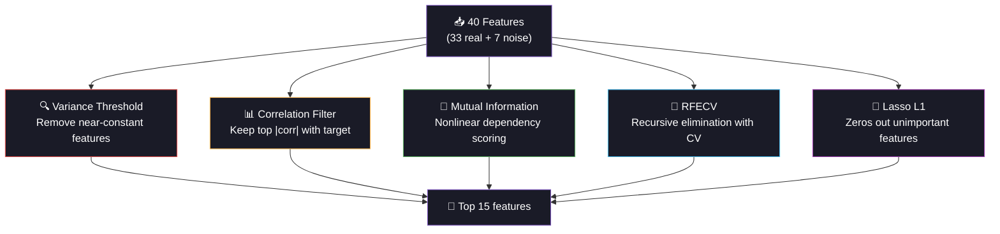

<div align="center">


<a href="https://git.io/typing-svg"></a>

<br/>

[](https://python.org)
[](https://pytorch.org)
[](https://scikit-learn.org)
[](#)

<br/>

[-7E57C2?style=flat-square&logo=target&logoColor=white)](#-chapter-3-svr)
[](#-chapter-2-the-detective)
[](#)
[](#-prologue-the-biological-clock)

<br/>


</div>

<br/>

---

## 📖 The Story of Day 16

*Inside every cell, a clock is ticking. At the ends of your chromosomes, protective caps called telomeres shorten with each cell division. When they're gone, the cell dies. Telomere length is the closest thing biology has to an "age meter" — and today, we predict it.*

---

<br/>

## 🧬 Prologue: The Biological Clock

<div align="center">

```
🧬 Chromosome with Telomeres

  Young Cell (telomere = 10+ kb)
  ╔══════════════════════════════════════════════╗
  ║▓▓▓▓▓▒▒▒▒▒▒▒▒▒▒▒▒▒▒▒▒▒▒▒▒▒▒▒▒▒▒▒▒▒▓▓▓▓▓║  ← Long telomere caps
  ╚══════════════════════════════════════════════╝
   ↑ telomere                        telomere ↑

  Aging Cell (telomere = 5-7 kb)
  ╔══════════════════════════════════════════════╗
  ║▓▓▒▒▒▒▒▒▒▒▒▒▒▒▒▒▒▒▒▒▒▒▒▒▒▒▒▒▒▒▒▒▒▒▒▒▓▓║  ← Shorter caps
  ╚══════════════════════════════════════════════╝

  Old Cell (telomere < 4 kb) → Cell death / senescence
  ╔══════════════════════════════════════════════╗
  ║▓▒▒▒▒▒▒▒▒▒▒▒▒▒▒▒▒▒▒▒▒▒▒▒▒▒▒▒▒▒▒▒▒▒▒▒▒▓║  ← Critical!
  ╚══════════════════════════════════════════════╝

  Shorter telomeres → aging, cancer risk, cardiovascular disease
  Longer telomeres  → cellular youth, longevity
```

</div>

> **The mission:** predict telomere length (in kilobases) from 40 clinical and genomic features — but 7 of those features are pure noise. Can our algorithms separate the biological signal from the irrelevant?

<br/>

<div align="center">

</div>

<br/>

## 🕵️ Chapter 1: The Trap — 7 Hidden Noise Features

> Of our 40 features, 33 are real biomarkers. 7 are **completely useless** — shoe size, eye color, birth month, zip code, a favorite number, and two random noise columns. If the model can't filter these out, it will fail.

```
40 Features:
  ✅ 33 Real Biomarkers            ❌ 7 Noise Traps
  ─────────────────────            ──────────────────
   Age, BMI, Blood Pressure         Shoe size
   Inflammatory markers (CRP, IL-6)  Eye color
   Telomerase activity               Birth month
   Hormones (cortisol, DHEA)        Zip code first digit
   Vitamins (D, B12, folate)         Favorite number
   Exercise, sleep, stress           Random noise × 2
   
  The question: can feature selection find the 7 impostors?
```

<br/>

<div align="center">

</div>

<br/>

## 🔬 Chapter 2: The Detective — 6 Feature Selection Methods

<div align="center">



</div>

### 📋 The 6 Methods Explained

| Method | How It Works | Catches Noise? | Speed |
|:-------|:------------|:---------------|:------|
| **None** | Keep all 40 features (baseline) | ❌ Keeps everything | ⚡ Instant |
| **Variance** | Remove features with near-zero variance | ⚠️ High variance ≠ useful | ⚡ Fast |
| **Correlation** | Keep top K features by \|correlation\| with target | ✅ Good for linear | ⚡ Fast |
| **Mutual Info** | Nonlinear dependency score (information theory) | ✅✅ Catches nonlinear too | 🔬 Medium |
| **RFECV** | Recursively remove worst feature, validate with CV | ✅✅✅ Gold standard | 🐌 Slow |
| **Lasso L1** | Regularization zeros out useless features | ✅✅ Simultaneous select+train | ⚡ Fast |

### 🎯 The Experiment Result

```
Method          → Features Kept  | Real ✅ | Noise 🔴 | Verdict
──────────────────────────────────────────────────────────────────
none            → 40             |   33    |    7      | ❌ Keeps all noise
variance        → 15             |   12    |    3      | ⚠️ Weak filter  
correlation     → 15             |   15    |    0      | ✅ Clean!
mutual_info     → 15             |   15    |    0      | ✅ Clean!
rfecv           → 15             |   14    |    1      | ✅ Nearly perfect
lasso           → 15             |   15    |    0      | ✅ Clean!
```

> **Lesson:** Variance threshold is the weakest — a random noise column can have high variance! Correlation, Mutual Info, and Lasso all correctly identified the noise features.

<br/>

<div align="center">

</div>

<br/>

## 🎯 Chapter 3: SVR — Support Vector Regression

> SVR finds a tube (ε-tube) around the regression line. Points inside the tube don't contribute to the loss. Only "support vectors" outside the tube shape the model.

```
SVR with ε-tube:

  y ┤         ●                    ● = support vector (outside tube)
    │     ●  ╱───────────╲        ○ = inside tube (ignored!)
    │    ╱──╱  ○  ○  ○    ╲──╲
    │   ╱  ╱  ○  ○  ○  ○   ╲  ╲  ← ε-tube width
    │  ╱──╱ ○  ○  ○  ○  ○   ╲──╲
    │ ╱  ╱────────────────────╲  ╲
    │●  ╱                      ╲  ●
    │──╱                        ╲──
    ┼────────────────────────────────→ x

  RBF Kernel: maps features to higher dimension
  where a linear tube can capture nonlinear patterns.
  
  Why SVR hates noise: RBF kernel computes distances between ALL
  features. Noise features add "random distance" → blurs the signal.
  Feature selection removes noise → distances become meaningful.
```

### 🎛️ SVR Hyperparameters

| Param | Values | Effect |
|:------|:-------|:-------|
| **C** | 0.1, 1, 10, 100 | Penalty for errors outside ε-tube (high C = fit harder) |
| **ε** | 0.01, 0.05, 0.1 | Tube width (larger = more tolerant of errors) |
| **kernel** | rbf, linear | RBF = nonlinear, linear = simple |
| **gamma** | scale, auto | RBF kernel width (controls flexibility) |

<br/>

<div align="center">

</div>

<br/>

## 📊 Chapter 4: The Data

| Property | Detail |
|:---------|:-------|
| **Subjects** | 3,500 individuals |
| **Features** | 40 total (33 real biomarkers + 7 deliberate noise) |
| **Target** | Telomere length (kilobases), continuous 3-14 kb |
| **Key predictors** | Age (-), telomerase activity (+), CRP (-), exercise (+) |
| **Noise features** | Shoe size, eye color, birth month, zip digit, favorite number, 2× random |
| **Challenge** | SVR must find 33 signals among 40 features, or noise degrades predictions |

<br/>

## 🏗️ Project Structure

```
day16_telomere_prediction/
├── 📄 main.py              ← Entry point
├── 📄 config.py             ← 6 selection methods, SVR grid, noise feature list
├── 📄 data_pipeline.py      ← Biomarker data + feature selection comparison
├── 📄 model_training.py     ← SVR per selection method + GridSearch + GPU NN
├── 📄 evaluation.py         ← Metrics + telomere-vs-age plot + error analysis
├── 📄 README.md
├── 📁 data/    ├── 📁 models/    ├── 📁 plots/
├── 📁 logs/    └── 📁 outputs/
```

<br/>

## ⚡ Quick Start

```bash
cd day16_telomere_prediction
python main.py
```

**Pipeline:**
1. 🧬 Generate 3,500 subjects (33 biomarkers + 7 noise traps)
2. 📊 EDA: telomere distribution + top biological predictors
3. 🔬 Run 6 feature selection methods (variance, corr, MI, RFECV, Lasso, none)
4. 🎯 Train SVR on EACH feature subset → proves which selection is best
5. 🎯 Full GridSearchCV on best subset (C, ε, kernel, gamma)
6. 🧠 GPU neural net on same subset for comparison
7. 📈 Evaluate + telomere-vs-age plot colored by prediction error

<br/>

<div align="center">

</div>

<br/>

## 📈 Chapter 5: The Visualizations

| # | Plot | The Story It Tells |
|:-:|:-----|:------------------|
| 01 | EDA | 🧬 Telomere distribution + top 5 biological predictors |
| 02 | **Selection Comparison** | 🔬 Stacked bar (real vs noise kept) + feature selection heatmap |
| 03 | **Selection vs Performance** | 🎯 SVR RMSE and R² for each of the 6 methods |
| 04 | NN Training | 🧠 Loss curves |
| 05 | Predictions | 📈 Actual vs predicted + residuals + telomere-vs-age colored by error |
| 06 | Comparison | 🏆 All models ranked |

<br/>

## ⚡ Tech Stack & Optimizations

| Optimization | Impact |
|:-------------|:-------|
| `float32` everywhere | 50% memory |
| `n_jobs=-1` for SVR GridSearch + RFECV | Full CPU parallelism |
| `AMP autocast` for GPU NN | Mixed precision speedup |
| `compress=3` joblib | Smaller saved models |
| `rasterized=True` scatter | Smaller plot files |
| Early stopping (patience=10) | No wasted NN epochs |
| Linear SVR for RFECV | Fast feature elimination |
| Best mask saved with model | Reproduce feature selection at inference |

<br/>

## 💡 Chapter 6: The Moral

| Lesson | Detail |
|:-------|:-------|
| **Feature selection before SVR** | SVR with RBF kernel is HURT by noise features (distance pollution) |
| **Variance is misleading** | High variance ≠ high predictive power (random noise has high variance!) |
| **Correlation catches linear** | Simple but misses nonlinear dependencies |
| **Mutual info catches nonlinear** | Information-theoretic — no distribution assumptions |
| **RFECV is gold standard** | Wraps model training into selection — but slowest |
| **Lasso = select + train** | L1 penalty zeros out noise — fast and effective |
| **Age = strongest predictor** | Every year ≈ -0.04 kb telomere length (biology confirmed) |
| **Noise features degrade SVR** | Going from 40 → 15 features IMPROVES accuracy |

<br/>

## 📦 Dependencies

```bash
numpy>=1.24
torch>=2.0
scikit-learn>=1.3
matplotlib>=3.7
pandas>=2.0
joblib>=1.3
```

<br/>

## 🔗 Part of 60 Days of ML & DL Challenge

<div align="center">

| Previous | Current | Next |
|:---------|:--------|:-----|
| [Day 15: BMI Prediction](../day15_bmi_prediction/) | **🧬 Day 16: Telomere Length** | [Day 17: Readmission Risk](../day17_readmission_risk/) |
| RF + Interaction Terms | SVR + Feature Selection | Logistic Regression + Time-Based Splits |

</div>

<br/>

<div align="center">


<br/>
<br/>


<br/>

<a href="https://git.io/typing-svg"></a>

</div>
