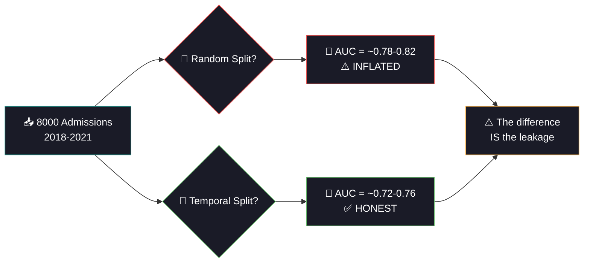

<div align="center">


<a href="https://git.io/typing-svg"></a>

<br/>

[](https://python.org)
[](https://pytorch.org)
[](https://scikit-learn.org)
[](#)

<br/>

[](#-chapter-2-the-trap)
[](#-chapter-5-calibration)
[](#)
[](#-chapter-3-the-discovery)

<br/>


</div>

<br/>

---

## 📖 The Story of Day 17

*A patient is discharged from the hospital. Will they be back within 30 days? Every unnecessary readmission costs $15,000+ and signals a failure in care. But here's the twist: the model you build today will predict FUTURE patients using only PAST data. Welcome to the reality of healthcare ML deployment.*

---

<br/>

## 🏥 Prologue: The $26 Billion Problem

<div align="center">

```
🏥 Hospital Readmission Timeline
═════════════════════════════════════════════════════════

  Day 0          Day 7           Day 14          Day 30
  ─────          ─────           ──────          ──────
  Discharge      "Feeling        "Back to ER"    📊 30-Day
  from hospital  okay..."                        Readmission
                                   ↓              Window
                              🔴 READMITTED
                              
  Cost: ~$15,000 per readmission
  US Total: ~$26 billion/year in avoidable readmissions
  
  CMS Penalty: Hospitals with high readmission rates
               get REDUCED Medicare payments
               
  🎯 If we can PREDICT who's at risk → intervene BEFORE they return
```

</div>

<br/>

<div align="center">

</div>

<br/>

## ⚠️ Chapter 1: The Rule — Train on Past, Predict Future

> On Day 1, we shuffled data randomly. On Day 13 (COVID), we learned temporal splits. Today, we see **why it REALLY matters** in healthcare deployment.

```
A hospital deploys a readmission model on January 1, 2021.
It was trained on... what data?

❌ WRONG: Random split
  ┌────────────────────────────────────────────────────┐
  │  2018  ■□■□  2019  □■■□  2020  ■□□■  2021  □■■□  │
  │                                                    │
  │  Model trains on 2021 data → then "predicts" 2021  │
  │  That's CHEATING. The hospital hasn't seen 2021    │
  │  patients yet on Jan 1!                            │
  │                                                    │
  │  → AUC = 0.82 (artificially inflated!)             │
  └────────────────────────────────────────────────────┘

✅ CORRECT: Temporal split
  ┌────────────────────────────────────────────────────┐
  │  2018 ■■■ | 2019 ■■■ | 2020 ■■■ | 2021 □□□□     │
  │  ─── TRAIN (past only) ──┤├── TEST (future) ──    │
  │                                                    │
  │  Model has NEVER seen 2021 patterns                │
  │  → AUC = 0.74 (honest! This is real performance)  │
  └────────────────────────────────────────────────────┘
```

<br/>

## 📉 Chapter 2: The Discovery — Temporal Drift

> "But wait — why would the split method change the score so much?"

Because the WORLD CHANGES over time. Hospital policies evolve, patient demographics shift, new treatments emerge. This is called **temporal drift**, and it's the #1 reason healthcare models degrade after deployment.

<div align="center">

```
Readmission Rate Over Time:

  20% ┤ ●
      │  ●  ●                         Policy change in 2020:
  18% ┤      ●  ●                     - Better discharge planning
      │           ●  ●                - Follow-up calls within 48h
  16% ┤                ●  ●           - Medication reconciliation
      │                     ●  ●
  14% ┤                          ●  ● 
      │                               Rate DROPPED 4 percentage
  12% ┤                               points over 4 years
      ┼────────────────────────────
      2018    2019    2020    2021

  Random split: averages old+new → model sees BOTH rates → inflated AUC
  Temporal split: trains on old rate → tests on new rate → HONEST AUC
```

</div>

<br/>

<div align="center">

</div>

<br/>

## 🧪 Chapter 3: The Experiment — Proving the Leakage

> We train the EXACT SAME Logistic Regression on both splits and measure the difference. If random gives higher AUC → that's the leakage.

<div align="center">



</div>

<br/>

## 🩺 Chapter 4: The Risk Factors

```
Top Readmission Risk Factors (from LR coefficients):

  INCREASES RISK 🔴                    DECREASES RISK 🔵
  ──────────────────                  ───────────────────
  📈 n_prev_admissions (+0.25)         📉 outpatient_visits (-0.05)
  📈 comorbidity_score  (+0.12)        📉 (regular follow-up = safer)
  📈 discharge_disposition (+0.30)
     (discharged to another facility)
  📈 er_visits           (+0.10)
  📈 n_diagnoses         (+0.08)
  📈 hba1c_result        (+0.20)
     (uncontrolled diabetes)
  📈 los_days            (+0.04)
     (longer stay = sicker patient)
```

<br/>

<div align="center">

</div>

<br/>

## 📊 Chapter 5: Calibration — Can You Trust the Probability?

> A model predicts "30% readmission risk." Does that mean 30% of patients with that score actually get readmitted? If not, the model is **uncalibrated** and clinically dangerous.

```
Calibration Curve:

  Actual
  readmit
  rate
  1.0 ┤                            ╱  Perfectly
      │                          ╱    calibrated
  0.8 ┤                        ╱      (ideal)
      │                      ╱
  0.6 ┤                    ╱
      │            ●     ╱         ● = Our model
  0.4 ┤          ●     ╱
      │        ●     ╱
  0.2 ┤      ●     ╱
      │    ●     ╱
  0.0 ┤  ●    ╱
      ┼────────────────────────
      0   0.2  0.4  0.6  0.8  1.0
          Predicted probability

  Points ON the diagonal = perfectly calibrated
  Points ABOVE = model underestimates risk (dangerous!)
  Points BELOW = model overestimates (too many false alarms)
```

<br/>

## 📊 Chapter 6: The Data

| Property | Detail |
|:---------|:-------|
| **Source** | Inspired by UCI Diabetes 130-US Hospitals dataset |
| **Admissions** | 8,000 over 4 years (2018-2021) |
| **Features** | 20 clinical + administrative |
| **Target** | 30-day readmission (binary, ~18% positive) |
| **Temporal drift** | Readmission rate drops ~4% over the time span |
| **Key challenge** | Time-based split + concept drift + class imbalance |

<br/>

## 🏗️ Project Structure

```
day17_readmission_risk/
├── 📄 main.py              ← Entry point
├── 📄 config.py             ← LR grid, NN arch, temporal settings
├── 📄 data_pipeline.py      ← Temporal data + time split + random split
├── 📄 model_training.py     ← LR + RF + GBM + temporal experiment + GPU NN
├── 📄 evaluation.py         ← ROC/PR + calibration + confusion + comparison
├── 📄 README.md
├── 📁 data/    ├── 📁 models/    ├── 📁 plots/
├── 📁 logs/    └── 📁 outputs/
```

<br/>

## ⚡ Quick Start

```bash
cd day17_readmission_risk
python main.py
```

**Pipeline:**
1. 🏥 Generate 8,000 admissions with temporal drift (2018-2021)
2. 📊 EDA: readmission rate over time + key risk factors
3. ⚠️ **THE EXPERIMENT:** train same LR on temporal vs random split → prove leakage
4. 📅 Proper temporal split (train 2018-2020, test 2021)
5. 🩺 LR GridSearch (L1/L2, balanced weighting) + RF + GBM baselines
6. 🧠 GPU NN with BCEWithLogitsLoss + pos_weight for imbalance
7. 📈 ROC/PR curves + **calibration curve** + confusion matrices

<br/>

<div align="center">

</div>

<br/>

## 📈 Chapter 7: The Visualizations

| # | Plot | The Story It Tells |
|:-:|:-----|:------------------|
| 01 | EDA | 🏥 Readmission rate over time (drift visible!) + key predictors |
| 02 | LR Coefficients | 🩺 Red = risk factors, Blue = protective factors |
| 03 | **Temporal vs Random** | ⚠️ Side-by-side proof that random split inflates AUC |
| 04 | NN Training | 🧠 BCE loss curves with early stopping |
| 05 | ROC + PR Curves | 📈 All models compared (AUC + Average Precision) |
| 06 | **Calibration Curve** | 📊 Are predicted probabilities trustworthy? |
| 07 | Confusion Matrices | 🏥 All 4 models side by side |
| 08 | Comparison | 🏆 Final rankings by AUC-ROC |

<br/>

## ⚡ Tech Stack & Optimizations

| Optimization | Impact |
|:-------------|:-------|
| `float32` everywhere | 50% memory |
| `class_weight='balanced'` for LR/RF | Handles 18% readmission imbalance |
| `pos_weight` in BCEWithLogitsLoss | GPU NN imbalance handling |
| `solver='saga'` | Supports both L1 and L2 penalties in same grid |
| `AMP autocast` | GPU mixed precision |
| `n_jobs=-1` | Parallel sklearn training |
| `compress=3` joblib | Smaller model files |
| Early stopping (patience=8) | No wasted GPU epochs |
| Temporal split preserves order | Zero data leakage |

<br/>

## 💡 Chapter 8: The Moral

| Lesson | Detail |
|:-------|:-------|
| **Temporal split is MANDATORY** | Any model deployed on future patients MUST be tested on future data |
| **Random split lies** | It mixes future into training → inflated metrics → model fails in production |
| **Drift is real** | Hospital policies, demographics, and disease patterns change over time |
| **Calibration > AUC** | A well-calibrated model with AUC=0.72 is more useful than uncalibrated AUC=0.80 |
| **LR is the hospital favorite** | Interpretable coefficients → clinicians trust and understand it |
| **Recall matters most** | Missing a readmission risk = patient suffers. False alarm = extra phone call. |
| **Imbalance needs handling** | 18% readmission → class_weight='balanced' or pos_weight |
| **This IS deployment reality** | Every hospital ML system faces temporal split + drift + calibration |

<br/>

## 📦 Dependencies

```bash
numpy>=1.24
pandas>=2.0
torch>=2.0
scikit-learn>=1.3
matplotlib>=3.7
joblib>=1.3
```

<br/>

## 🔗 Part of 60 Days of ML & DL Challenge

<div align="center">

| Previous | Current | Next |
|:---------|:--------|:-----|
| [Day 16: Telomere Length](../day16_telomere_prediction/) | **🏥 Day 17: Readmission Risk** | [Day 18: Gene Expression](../day18_gene_expression/) |
| SVR + Feature Selection | LR + Time-Based Splits | Neural Net DL Regression |

</div>

<br/>

<div align="center">


<br/>
<br/>


<br/>

<a href="https://git.io/typing-svg"></a>

</div>
