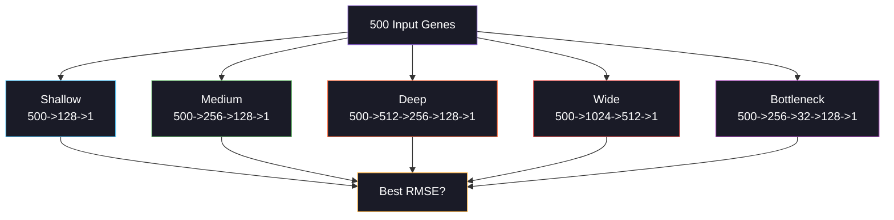

<div align="center">


<a href="https://git.io/typing-svg"></a>

<br/>

[](https://python.org)
[](https://pytorch.org)
[](#)
[](#)

<br/>

[](#)
[](#-chapter-3-the-tournament)
[](#)
[](#-chapter-1-the-genome)

<br/>


</div>

<br/>

---

## The Story of Day 18

*Deep inside every cell, thousands of genes are being expressed simultaneously -- some loudly, some whispered. If we measure 500 of those genes, can a neural network predict the expression of an unmeasured target gene? And what architecture should we use? Today, five neural networks enter a tournament to find out.*

---

<br/>

## 🧬 Chapter 1: The Genome

<div align="center">

```
    The Gene Expression Problem
    ============================

    500 Input Gene Probes                    1 Target Gene
    =====================                    =============

    Gene_0001  [0.82]  ---.
    Gene_0002  [1.45]  ----\
    Gene_0003  [-0.31] -----\      5 Latent         Target
    Gene_0004  [0.67]  ------}---> Biological  ---> Expression
    ...                ------}     Pathways          Level
    Gene_0149  [-1.02] -----/                       [???]
    Gene_0150  [0.55]  ----/   <-- 150 SIGNAL genes
                       ---'
    Gene_0151  [0.23]  ......  <-- 350 NOISE genes
    Gene_0152  [-0.89] ......      (no relationship to target!)
    ...                ......
    Gene_0500  [0.11]  ......

    The neural net must learn:
    1. WHICH 150 genes carry signal (ignore the 350 noise genes)
    2. The NONLINEAR mapping from pathway activations to expression
    3. INTERACTIONS between genes (gene_A * gene_B matters)
```

</div>

### Why This Is Hard

| Challenge | Detail |
|:----------|:-------|
| **High dimensionality** | 500 features, only 4,000 samples (p/n ratio = 0.125) |
| **70% noise features** | 350 out of 500 genes carry ZERO signal |
| **Nonlinear target** | Expression = tanh + squared + interaction terms |
| **5 latent pathways** | Signal is mediated through hidden biological processes |
| **Small sample size** | Genomics datasets are often limited by cost |

<br/>

<div align="center">

</div>

<br/>

## 🧠 Chapter 2: Why DL for Genomics?

> Days 1-17 used DL as a comparison model. Today, DL is the **primary** model. Linear regression can't capture gene interactions like (Gene_A * Gene_B) or nonlinearities like tanh(Gene_C).

```
Linear model sees:       y = w1*Gene_A + w2*Gene_B + w3*Gene_C
                         (misses interactions and nonlinear effects)

Neural net learns:       y = f(W3 * ReLU(W2 * ReLU(W1 * [Gene_A, Gene_B, Gene_C])))
                         (captures arbitrary nonlinear combinations!)

Hidden layers = "virtual pathways" that the network discovers:
  Layer 1: detects individual gene activations
  Layer 2: combines genes into pathway-level features
  Output:  maps pathways to expression level
```

<br/>

<div align="center">

</div>

<br/>

## 🏆 Chapter 3: The Tournament -- 5 Architectures

<div align="center">



</div>

### The 5 Contenders

| Architecture | Hidden Layers | Params | Philosophy |
|:-------------|:-------------|:-------|:-----------|
| **Shallow** | [128] | ~65K | "Keep it simple. One layer might be enough." |
| **Medium** | [256, 128] | ~165K | "Two layers capture most patterns." |
| **Deep** | [512, 256, 128] | ~420K | "More layers = more abstraction." |
| **Wide** | [1024, 512] | ~1M+ | "Width = capacity to memorize." |
| **Bottleneck** | [256, 32, 128] | ~75K | "Compress to 32D, then expand. Like an autoencoder." |

### What Each Teaches Us

```
Shallow (1 layer):
  + Fast training, few parameters
  + Less overfitting risk
  - May miss complex gene interactions
  
Deep (3 layers):
  + Each layer captures higher-level abstractions
  + Can model deep biological pathways
  - Needs more data to train, slower convergence
  
Bottleneck (256->32->128):
  + Forces network to find a compressed representation
  + 32D bottleneck = learned "pathway summary"
  + Acts like a built-in feature selector
  - May lose important information in compression
  
Wide (1024->512):
  + Massive capacity to memorize patterns
  - HIGHEST overfitting risk with only 4000 samples
  - Slowest to train
```

<br/>

<div align="center">

</div>

<br/>

## 📊 Chapter 4: The Data

| Property | Detail |
|:---------|:-------|
| **Samples** | 4,000 (train/val/test: 70/15/15%) |
| **Input genes** | 500 (150 signal + 350 noise, shuffled) |
| **Target** | Expression level of 1 target gene (continuous) |
| **Nonlinearity** | tanh, squared, sin, and interaction terms |
| **Latent pathways** | 5 hidden biological processes drive expression |
| **Challenge** | Network must ignore 70% of features to succeed |

<br/>

## 🏗️ Project Structure

```
day18_gene_expression/
+-- main.py              <-- Entry point (ASCII logging, Windows-safe)
+-- config.py             <-- 5 architecture definitions, training params
+-- data_pipeline.py      <-- Genomic data with latent pathways + PCA viz
+-- model_training.py     <-- build_model() + train 5 architectures + baselines
+-- evaluation.py         <-- DL vs ML comparison + capacity analysis
+-- README.md
+-- data/    +-- models/    +-- plots/
+-- logs/    +-- outputs/
```

<br/>

## Quick Start

```bash
cd day18_gene_expression
python main.py
```

**Pipeline:**
1. Generate 4,000 samples with 500 genes (5 latent pathways)
2. EDA: PCA projection, signal vs noise correlation histograms
3. Train 5 DL architectures on GPU (AMP + early stopping)
4. Train Ridge, Lasso, RF baselines for context
5. Evaluate all 8 models: RMSE, R2 + capacity-vs-performance analysis
6. Generate 6 publication-quality plots

<br/>

<div align="center">

</div>

<br/>

## Chapter 5: The Visualizations

| # | Plot | The Story |
|:-:|:-----|:----------|
| 01 | **EDA** | PCA projection colored by expression + signal vs noise correlation histograms |
| 02 | **Architecture Comparison** | RMSE bars + params-vs-RMSE scatter + training time |
| 03 | **Training Curves** | All 5 architectures: train/val loss side by side |
| 04 | **Predictions** | DL vs Ridge: actual vs predicted + residuals + error distributions |
| 05 | **DL vs ML** | All 8 models ranked (purple=DL, blue=ML) |
| 06 | **Capacity Curve** | Params vs RMSE scatter -- is bigger always better? |

<br/>

## Tech Stack & Optimizations

| Optimization | Impact |
|:-------------|:-------|
| `float32` everywhere | 50% memory vs float64 |
| `AMP autocast + GradScaler` | ~2x GPU speedup |
| `set_to_none=True` | Faster grad zeroing |
| `drop_last=True` | BatchNorm stability |
| `ReduceLROnPlateau` | Auto LR decay on plateau |
| Early stopping (patience=10) | Stop overfitting architectures early |
| `build_model()` factory | One function creates all 5 architectures |
| `n_jobs=-1` for sklearn | Parallel RF training |
| Three-way split | Train/val/test prevents selection bias |
| `encoding='utf-8'` in FileHandler | Windows-safe logging |
| ASCII-only console output | No cp1252 encoding errors |

<br/>

## Chapter 6: The Moral

| Lesson | Detail |
|:-------|:-------|
| **DL captures nonlinearity** | Gene interactions (A*B) and nonlinear functions (tanh, sin) that Ridge misses |
| **Medium often wins** | 2-layer (256->128) frequently beats deeper/wider on limited data |
| **Bottleneck = built-in selection** | 32D compression forces the network to summarize 500 genes |
| **Wide overfits** | 1M+ parameters on 4,000 samples = memorization risk |
| **Noise hurts DL too** | 350 noise features add gradient noise -- dropout helps |
| **BatchNorm is critical** | Stabilizes training on high-dimensional genomic data |
| **Params vs performance** | More parameters help up to a point, then hurt (bias-variance tradeoff) |
| **Foundation for genomics** | This architecture comparison pattern applies to RNA folding (Day 36), multi-omics (Day 37), etc. |

<br/>

## Dependencies

```bash
numpy>=1.24
torch>=2.0
scikit-learn>=1.3
matplotlib>=3.7
seaborn>=0.12
pandas>=2.0
joblib>=1.3
```

<br/>

## Part of 60 Days of ML & DL Challenge

<div align="center">

| Previous | Current | Next |
|:---------|:--------|:-----|
| [Day 17: Readmission Risk](../day17_readmission_risk/) | **DNA Day 18: Gene Expression** | [Day 19: Radiosensitivity](../day19_radiosensitivity/) |
| LR + Time-Based Splits | DL Regression (5 architectures) | Elastic Net + Cross-Dataset Validation |

</div>

<br/>

<div align="center">


<br/>
<br/>


<br/>

<a href="https://git.io/typing-svg"></a>

</div>
