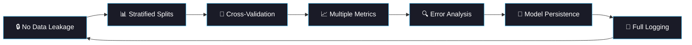

<div align="center">

<!-- Animated Header Banner -->
<div align="center">

# 🧠 60 Days of ML & Deep Learning

### *From Logistic Regression to Geometric Deep Learning — One Project Per Day*

<br/>


</div>

<!-- Animated Typing -->
<a href="https://git.io/typing-svg"></a>

<br/>

<!-- Badges Row 1 -->
[](https://python.org)
[](https://pytorch.org)
[](https://scikit-learn.org)
[](LICENSE)

<!-- Badges Row 2 -->
[](#progress-tracker)
[](#-phase-1-classical-ml-foundations-days-110)
[](#-complete-project-roadmap)

<br/>

<!-- Social/Profile Badges — customize with your own links -->
[](https://github.com/Priyanshi1771)
[](https://www.linkedin.com/in/priyanshipatel1771/)
[](https://priyanshi-patel-portfolio.netlify.app/)

<br/>

<!-- Animated Line -->


</div>

<br/>

## 🎯 What Is This?

> **A 60-day structured challenge to go from ML fundamentals to research-level AI engineering — through hands-on projects, not passive learning.**

Every single day, I build a **complete, production-ready ML/DL pipeline** from scratch. No toy scripts. No copy-paste notebooks. Each project includes a proper data pipeline, model training with cross-validation, comprehensive evaluation, error analysis, and modular code that a team could actually maintain.

The domain focus is **Healthcare & Biomedical AI** — one of the most impactful applications of machine learning, where getting predictions wrong can cost lives.

<br/>

<div align="center">

```
📅 Day 1                                                    📅 Day 60
 │                                                              │
 ▼                                                              ▼
 Logistic Regression ──► CNNs ──► Transformers ──► GNNs ──► Research
 │                       │          │                │          │
 Feature Importance    U-Net      BERT NER       Drug Discovery  Few-Shot
 Cross-Validation     ResNet     Text Mining     Graph Neural    Meta-Learning
 SHAP Values         Transfer    Clinical NLP    Protein Struct  Diffusion Models
```

</div>

<br/>

## 🏗️ Repository Architecture

```
60-Days-ML-DL-Challenge/
│
├── 📄 README.md                          ← You are here
├── 📄 LICENSE
├── 📄 requirements.txt                   ← Global dependencies
├── 📄 setup.py                           ← Package setup
├── 📄 .gitignore
│
├── 📁 day01_heart_disease/               ← Each day is a self-contained project
│   ├── main.py                           ← Entry point (run this)
│   ├── config.py                         ← Hyperparameters & paths
│   ├── data_pipeline.py                  ← Loading, preprocessing, splitting
│   ├── model_training.py                 ← Training, validation, persistence
│   ├── evaluation.py                     ← Metrics, plots, error analysis
│   ├── data/                             ← Raw data (gitignored)
│   ├── models/                           ← Saved model checkpoints
│   ├── plots/                            ← Generated visualizations
│   ├── logs/                             ← Experiment logs
│   └── outputs/                          ← Final results & reports
│
├── 📁 day02_breast_cancer/
│   └── ...                               ← Same clean structure
│
├── 📁 day03_diabetes_prediction/
│   └── ...
│
│   ... (one folder per day)
│
├── 📁 day60_few_shot_rare_disease/
│   └── ...
│
├── 📁 common/                            ← Shared utilities across projects
│   ├── utils.py                          ← Logging, seeding, helpers
│   ├── visualization.py                  ← Reusable plotting functions
│   └── metrics.py                        ← Custom metric implementations
│
└── 📁 notebooks/                         ← Optional exploration notebooks
    └── eda_templates.ipynb
```

<br/>

<div align="center">

</div>

<br/>

## ⚡ Quick Start

```bash
# 1. Clone the repository
git clone https://github.com/Priyanshi1771/60-Days-ML-Challenge.git
cd 60-Days-ML-DL-Challenge

# 2. Install dependencies
pip install -r requirements.txt

# 3. Run any day's project
cd day01_heart_disease
python main.py
```

<br/>

## 🛠️ Tech Stack

<div align="center">

<table>
<tr>
<td align="center" width="140">

<br><b>Python 3.10+</b>
<br><sub>Core Language</sub>
</td>
<td align="center" width="140">

<br><b>PyTorch</b>
<br><sub>Deep Learning</sub>
</td>
<td align="center" width="140">

<br><b>Scikit-Learn</b>
<br><sub>Classical ML</sub>
</td>
<td align="center" width="140">

<br><b>Pandas</b>
<br><sub>Data Wrangling</sub>
</td>
<td align="center" width="140">

<br><b>NumPy</b>
<br><sub>Numerical Ops</sub>
</td>
</tr>
<tr>
<td align="center" width="140">

<br><b>Seaborn</b>
<br><sub>Visualization</sub>
</td>
<td align="center" width="140">

<br><b>Matplotlib</b>
<br><sub>Plotting</sub>
</td>
<td align="center" width="140">

<br><b>Docker</b>
<br><sub>Containerization</sub>
</td>
<td align="center" width="140">

<br><b>Git</b>
<br><sub>Version Control</sub>
</td>
<td align="center" width="140">

<br><b>Jupyter</b>
<br><sub>Exploration</sub>
</td>
</tr>
</table>

</div>

<br/>

<div align="center">

</div>

<br/>

## 📊 Progress Tracker

<div align="center">

> 🟩 = Complete &nbsp;&nbsp; 🟨 = In Progress &nbsp;&nbsp; ⬜ = Upcoming

<!-- UPDATE THIS AS YOU COMPLETE EACH DAY -->

| Week | Mon | Tue | Wed | Thu | Fri | Sat | Sun |
|:----:|:---:|:---:|:---:|:---:|:---:|:---:|:---:|
| **1** | 🟩 D1 | 🟩 D2 | ⬜ D3 | ⬜ D4 | ⬜ D5 | ⬜ D6 | ⬜ D7 |
| **2** | ⬜ D8 | ⬜ D9 | ⬜ D10 | ⬜ D11 | ⬜ D12 | ⬜ D13 | ⬜ D14 |
| **3** | ⬜ D15 | ⬜ D16 | ⬜ D17 | ⬜ D18 | ⬜ D19 | ⬜ D20 | ⬜ D21 |
| **4** | ⬜ D22 | ⬜ D23 | ⬜ D24 | ⬜ D25 | ⬜ D26 | ⬜ D27 | ⬜ D28 |
| **5** | ⬜ D29 | ⬜ D30 | ⬜ D31 | ⬜ D32 | ⬜ D33 | ⬜ D34 | ⬜ D35 |
| **6** | ⬜ D36 | ⬜ D37 | ⬜ D38 | ⬜ D39 | ⬜ D40 | ⬜ D41 | ⬜ D42 |
| **7** | ⬜ D43 | ⬜ D44 | ⬜ D45 | ⬜ D46 | ⬜ D47 | ⬜ D48 | ⬜ D49 |
| **8** | ⬜ D50 | ⬜ B1 | ⬜ B2 | ⬜ B3 | ⬜ B4 | ⬜ B5 | ⬜ B6 |
| **9** | ⬜ B7 | ⬜ B8 | ⬜ B9 | ⬜ B10 | ⬜ B11 | ⬜ B12 | ⬜ B13 |

<!-- Progress Bar — update the percentage manually -->
**Overall Progress**

```text
Phase 1 ████░░░░░░░░░░░░░░░░  10%  ──  Classical ML Foundations
Phase 2 ░░░░░░░░░░░░░░░░░░░░   0%  ──  Regression & Time-Series
Phase 3 ░░░░░░░░░░░░░░░░░░░░   0%  ──  Deep Learning & Medical Imaging
Phase 4 ░░░░░░░░░░░░░░░░░░░░   0%  ──  Genomics & Advanced ML
Phase 5 ░░░░░░░░░░░░░░░░░░░░   0%  ──  NLP, Clustering & Anomaly Detection
Phase 6 ░░░░░░░░░░░░░░░░░░░░   0%  ──  Frontiers (Privacy, XAI, RL, GANs)
Bonus   ░░░░░░░░░░░░░░░░░░░░   0%  ──  28 Advanced Bonus Projects
──────────────────────────────────────────────────────────────────
Total   ░░░░░░░░░░░░░░░░░░░░   1%  ──  2 / 78 Projects Complete
```

</div>

<br/>

<div align="center">

</div>

<br/>

## 🗺️ Complete Project Roadmap

<!-- ═══════════════════════════════════════════════════════════════ -->
### 🔷 Phase 1: Classical ML Foundations (Days 1–10)
<!-- ═══════════════════════════════════════════════════════════════ -->

> *Master the fundamentals that every ML engineer needs. These aren't "beginner" projects — they're the foundation for everything that follows.*

<details>
<summary><b>Click to expand Phase 1 details</b></summary>
<br/>

| Day | Project | Dataset | Model / Focus | Key Learning | Status |
|:---:|:--------|:--------|:--------------|:-------------|:------:|
| 1 | Heart Disease Prediction| UCI Heart Disease | Logistic Regression | Feature importance analysis, threshold tuning | ✅ |
| 2 | Breast Cancer Diagnosis | UCI Breast Cancer Wisconsin | Decision Tree | Cross-validation, tree pruning |✅  |
| 3 | Diabetes Onset Prediction | Pima Indians (UCI) | Random Forest | SMOTE / imbalanced data handling | ⬜ |
| 4 | Liver Cirrhosis Detection | Indian Liver (UCI) | SVM | Decision boundary visualization | ⬜ |
| 5 | Thyroid Disease Classification | UCI Thyroid | Naive Bayes | Ensemble voting classifiers | ⬜ |
| 6 | Kidney Disease Prediction | Chronic Kidney Disease (UCI) | KNN | GridSearch hyperparameter tuning | ⬜ |
| 7 | Stroke Risk Prediction | Kaggle Stroke Dataset | XGBoost | SHAP interpretability | ⬜ |
| 8 | Anemia Detection | Kaggle Anemia Dataset | AdaBoost | Scaling + outlier removal | ⬜ |
| 9 | Hepatitis Diagnosis | UCI Hepatitis | Perceptron | ROC curve analysis | ⬜ |
| 10 | Malaria Cell Classification | Kaggle Malaria Images | Basic CNN | **Introduction to Deep Learning** | ⬜ |

**Skills Unlocked:** Data preprocessing, cross-validation, hyperparameter tuning, evaluation metrics, model interpretability, handling class imbalance.

</details>

<br/>

<!-- ═══════════════════════════════════════════════════════════════ -->
### 🔷 Phase 2: Regression & Time-Series (Days 11–20)
<!-- ═══════════════════════════════════════════════════════════════ -->

> *Move beyond classification into continuous predictions and sequential data.*

<details>
<summary><b>Click to expand Phase 2 details</b></summary>
<br/>

| Day | Project | Dataset | Model / Focus | Key Learning | Status |
|:---:|:--------|:--------|:--------------|:-------------|:------:|
| 11 | ICU Mortality Prediction | MIMIC-IV Demo | Linear Regression | Polynomial features | ⬜ |
| 12 | Blood Pressure Prediction | Kaggle BP Dataset | Ridge Regression | Multicollinearity handling | ⬜ |
| 13 | COVID-19 Case Forecasting | OWID / Kaggle | ARIMA | Time-series introduction | ⬜ |
| 14 | Drug Response Prediction | UCI Drug Review | Lasso Regression | Text feature extraction (TF-IDF) | ⬜ |
| 15 | BMI Prediction | Kaggle Obesity Dataset | Random Forest Regressor | Interaction terms | ⬜ |
| 16 | Telomere Length Prediction | NIH Dataset | SVR | Feature selection techniques | ⬜ |
| 17 | Hospital Readmission Risk | UCI Diabetes 130-US | Logistic Regression | Time-based splits | ⬜ |
| 18 | Gene Expression Prediction | GTEx Subset | Neural Network | **DL regression introduction** | ⬜ |
| 19 | Radiosensitivity Prediction | Public Dataset | Elastic Net | Cross-dataset validation | ⬜ |
| 20 | Viral Load Forecasting | UCI HIV Dataset | LSTM | **Sequential modeling** | ⬜ |

**Skills Unlocked:** Regression metrics, time-series modeling, regularization tradeoffs, feature selection, LSTM fundamentals.

</details>

<br/>

<!-- ═══════════════════════════════════════════════════════════════ -->
### 🔷 Phase 3: Deep Learning & Medical Imaging (Days 21–30)
<!-- ═══════════════════════════════════════════════════════════════ -->

> *This is where it gets serious. CNNs, transfer learning, segmentation — the core of medical AI.*

<details>
<summary><b>Click to expand Phase 3 details</b></summary>
<br/>

| Day | Project | Dataset | Model / Focus | Key Learning | Status |
|:---:|:--------|:--------|:--------------|:-------------|:------:|
| 21 | Pneumonia Detection | Kaggle Chest X-ray | CNN | Data augmentation strategies | ⬜ |
| 22 | Brain Tumor Segmentation | Kaggle MRI | U-Net | **Segmentation introduction** | ⬜ |
| 23 | Skin Lesion Classification | ISIC Dataset | ResNet (Transfer Learning) | Transfer learning methodology | ⬜ |
| 24 | Diabetic Retinopathy | APTOS 2019 | VGG16 | Fine-tuning pretrained models | ⬜ |
| 25 | Lung Cancer Detection | LUNA16 (NIH) | 3D CNN | **Volumetric imaging** | ⬜ |
| 26 | Mammogram Analysis | Mini-MIAS | DenseNet | Dense connections architecture | ⬜ |
| 27 | Cardiac Arrhythmia | Kaggle ECG Images | Custom CNN | Wavelet transforms | ⬜ |
| 28 | Bone Fracture Detection | MURA (Stanford) | InceptionV3 | Multi-scale feature extraction | ⬜ |
| 29 | Retinal Disease Classification | ODIR (Kaggle) | Multi-class CNN | Multi-class strategies | ⬜ |
| 30 | Pathology Slide Analysis | PatchCamelyon | Attention-based DL | **Attention mechanisms** | ⬜ |

**Skills Unlocked:** CNN architectures, transfer learning, segmentation, 3D convolutions, attention mechanisms, medical image preprocessing.

</details>

<br/>

<!-- ═══════════════════════════════════════════════════════════════ -->
### 🔷 Phase 4: Genomics & Advanced ML (Days 31–40)
<!-- ═══════════════════════════════════════════════════════════════ -->

> *Enter the world of computational biology, graph neural networks, and multi-omics.*

<details>
<summary><b>Click to expand Phase 4 details</b></summary>
<br/>

| Day | Project | Dataset | Model / Focus | Key Learning | Status |
|:---:|:--------|:--------|:--------------|:-------------|:------:|
| 31 | Cancer Type Classification | TCGA Subset | PCA + SVM | Dimensionality reduction | ⬜ |
| 32 | Protein Interaction Prediction | STRING Subset | Node2Vec (Graph ML) | **Graph embeddings** | ⬜ |
| 33 | Mutation Impact Classification | COSMIC Subset | Random Forest | Genomic feature engineering | ⬜ |
| 34 | Personalized Medicine | NIH Pharmacogenomics | Ensemble ML | Stacking & blending | ⬜ |
| 35 | Variant Calling Simulation | 1000 Genomes | DL Classifier | Genomic data pipelines | ⬜ |
| 36 | RNA Folding Prediction | RNAcentral | RNN | Sequence-to-structure | ⬜ |
| 37 | Multi-Omics Integration | UK Biobank | Multimodal Fusion | **Multi-modal learning** | ⬜ |
| 38 | Epigenetic Marker Classification | ENCODE | Autoencoders | Representation learning | ⬜ |
| 39 | Microbiome Diversity Prediction | HMP | Clustering + Classification | Unsupervised + supervised | ⬜ |
| 40 | Drug-Target Interaction | ChEMBL | Graph Neural Networks | **GNN fundamentals** | ⬜ |

**Skills Unlocked:** Graph neural networks, multi-modal fusion, autoencoders, dimensionality reduction, genomic pipelines.

</details>

<br/>

<!-- ═══════════════════════════════════════════════════════════════ -->
### 🔷 Phase 5: NLP, Clustering & Anomaly Detection (Days 41–45)
<!-- ═══════════════════════════════════════════════════════════════ -->

> *Clinical NLP, patient subtyping, and real-time anomaly detection.*

<details>
<summary><b>Click to expand Phase 5 details</b></summary>
<br/>

| Day | Project | Dataset | Model / Focus | Key Learning | Status |
|:---:|:--------|:--------|:--------------|:-------------|:------:|
| 41 | Medical Text De-Identification | i2b2 Dataset | spaCy / BERT (NER) | Named entity recognition | ⬜ |
| 42 | Symptom-Based Prediction | Kaggle Symptom Dataset | NLP + ML | Text preprocessing for clinical data | ⬜ |
| 43 | Clinical Trial Outcome Prediction | ClinicalTrials.gov | Text Classification | Document-level classification | ⬜ |
| 44 | Patient Subtype Clustering | MIMIC-III Demo | K-Means | Unsupervised discovery | ⬜ |
| 45 | Vital Sign Anomaly Detection | PhysioNet | Isolation Forest | **Anomaly detection** | ⬜ |

**Skills Unlocked:** NER, BERT fine-tuning, clinical NLP pipelines, clustering evaluation, anomaly detection.

</details>

<br/>

<!-- ═══════════════════════════════════════════════════════════════ -->
### 🔷 Phase 6: Frontiers — Privacy, XAI, RL & Generative AI (Days 46–50)
<!-- ═══════════════════════════════════════════════════════════════ -->

> *The cutting edge. Federated learning, explainability, reinforcement learning, and GANs.*

<details>
<summary><b>Click to expand Phase 6 details</b></summary>
<br/>

| Day | Project | Dataset | Model / Focus | Key Learning | Status |
|:---:|:--------|:--------|:--------------|:-------------|:------:|
| 46 | Federated Learning Simulation | Multiple UCI | Privacy ML | Distributed training | ⬜ |
| 47 | Bias Detection in Models | UCI Heart Dataset | AIF360 | Fairness metrics | ⬜ |
| 48 | Explainable AI for Diagnostics | UCI Breast Cancer | LIME | Model explainability | ⬜ |
| 49 | RL for Treatment Optimization | OpenAI Gym Simulation | Reinforcement Learning | **RL fundamentals** | ⬜ |
| 50 | Generative AI for Augmentation | Chest X-ray | GANs | **Generative modeling** | ⬜ |

**Skills Unlocked:** Federated learning, fairness/bias auditing, LIME/SHAP explanations, RL policies, GAN training.

</details>

<br/>

<!-- ═══════════════════════════════════════════════════════════════ -->
### 🌟 Bonus Projects (28 Advanced Challenges)
<!-- ═══════════════════════════════════════════════════════════════ -->

> *For when 50 days aren't enough. Diffusion models, meta-learning, geometric DL, and more.*

<details>
<summary><b>Click to expand all 28 bonus projects</b></summary>
<br/>

| # | Project | Dataset | Key Techniques | Status |
|:-:|:--------|:--------|:---------------|:------:|
| B1 | Parkinson's Detection from Voice | UCI Parkinson's | MFCC extraction, Random Forest | ⬜ |
| B2 | Skin Lesion Segmentation (U-Net) | HAM10000 | U-Net, Dice Loss | ⬜ |
| B3 | Alzheimer's MRI Stage Prediction | OASIS Brain | CNN, MRI preprocessing | ⬜ |
| B4 | ECG Arrhythmia (1D Signal Model) | MIT-BIH | 1D CNN, Signal processing | ⬜ |
| B5 | Mental Health NLP Sentiment | Kaggle Mental Health Text | BERT, NLP classification | ⬜ |
| B6 | Synthetic EHR Generation | MIMIC-III Demo | GAN / CTGAN, Data synthesis | ⬜ |
| B7 | Seizure Prediction from EEG | UCI EEG | LSTM, Sliding window | ⬜ |
| B8 | Multi-Modal Disease Fusion | ADNI | Multi-modal neural networks | ⬜ |
| B9 | Wearable Sensor Activity Recognition | UCI MHealth | KNN, Time-series classification | ⬜ |
| B10 | Missing Biomedical Data Imputation | UCI Mice Protein | Variational Autoencoder (VAE) | ⬜ |
| B11 | Longitudinal Disease Progression | Human Mortality DB | RNN, Survival analysis | ⬜ |
| B12 | OCR for Digitizing Medical Records | Synthetic Health Records | Tesseract OCR, Image preprocessing | ⬜ |
| B13 | Robotic Surgery Tool Segmentation | Cholec80 | U-Net, Video frame segmentation | ⬜ |
| B14 | Doctor Recommendation System | Kaggle Healthcare Providers | Collaborative filtering | ⬜ |
| B15 | Bone Age Prediction (Regression CNN) | RSNA Bone Age | CNN regression | ⬜ |
| B16 | Diffusion Model for MRI Generation | OASIS | **Diffusion models** | ⬜ |
| B17 | Prompt Engineering for Medical Chatbots | PubMed | GPT fine-tuning, Prompt design | ⬜ |
| B18 | Agent-Based Epidemic Modeling | WHO Dataset | Agent-based simulation | ⬜ |
| B19 | Bayesian Network for Genetic Risk | 1000 Genomes | Bayesian probabilistic modeling | ⬜ |
| B20 | Few-Shot Rare Disease Classification | Open Neuro | **Meta-learning, Prototypical nets** | ⬜ |
| B21 | Self-Supervised Learning (SimCLR) | CT Medical Images | **Contrastive learning** | ⬜ |
| B22 | Graph-Based Drug Discovery | Merck Molecular Activity | Graph CNN, Molecular graphs | ⬜ |
| B23 | Ambient AI Clinical Note Automation | MIMIC Notes | Speech-to-text + LLM summarization | ⬜ |
| B24 | Multi-Label Disease Classification | CHDS Dataset | Multi-label neural networks | ⬜ |
| B25 | Geometric DL for Protein Structure | PDB | **Geometric Deep Learning** | ⬜ |
| B26 | Time-Series GAN for Vital Signs | MIMIC Critical Care | TimeGAN | ⬜ |
| B27 | LLM Medical Literature Summarization | PubChem BioAssay | LLM fine-tuning | ⬜ |
| B28 | Interactive AI Annotation Tool | DeepLesion | Active learning, Human-in-loop | ⬜ |

</details>

<br/>

<div align="center">

</div>

<br/>

## 🧠 Core Principles Followed Every Day

<div align="center">



</div>

Every single project in this repository follows these **non-negotiable** engineering practices:

| Principle | What It Means | Why It Matters |
|:----------|:-------------|:---------------|
| **🔒 No Data Leakage** | Fit scalers/encoders on train set ONLY | Prevents fake-good results that collapse in production |
| **📊 Stratified Splits** | Class proportions preserved in all splits | Essential for imbalanced medical datasets |
| **🔁 Cross-Validation** | K-fold CV for every model selection decision | Single splits are unreliable on small datasets |
| **📈 Multiple Metrics** | Accuracy + F1 + AUC + Confusion Matrix | Accuracy alone hides dangerous failure modes |
| **🔍 Error Analysis** | Examine every misclassified sample | Reveals *where* and *why* the model fails |
| **🌱 Reproducibility** | Fixed seeds for Python, NumPy, PyTorch, CUDA | Same code → same results, every time |
| **📝 Full Logging** | Timestamped logs to file, not print statements | Searchable, persistent, filterable records |
| **🗂️ Modular Code** | Separate files for data, training, evaluation | Testable, reusable, team-friendly |
| **💾 Save Everything** | Model + scaler + config saved together | You can reproduce any experiment from artifacts |

<br/>

## 🏃 How to Navigate This Repository

**If you're following along with the challenge:**

Each day's folder is completely self-contained. Enter any `dayXX_*/` folder, read the docstrings in `main.py` for an overview, then run it. The code is heavily commented — not just *what* each line does, but *why* it matters and what common mistakes to avoid.

**If you're looking for a specific technique:**

| Looking for... | Go to |
|:---------------|:------|
| SMOTE / class imbalance | Day 3 |
| SHAP interpretability | Day 7 |
| CNN from scratch | Day 10, 21 |
| U-Net segmentation | Day 22 |
| Transfer learning (ResNet, VGG) | Days 23, 24 |
| LSTM / sequential modeling | Day 20 |
| BERT / NER | Day 41 |
| Graph Neural Networks | Day 40 |
| GANs | Day 50 |
| Reinforcement Learning | Day 49 |
| Diffusion Models | Bonus 16 |
| Meta-Learning / Few-Shot | Bonus 20 |

<br/>

## 📦 Global Dependencies

```bash
# Core
python>=3.10
numpy>=1.24
pandas>=2.0
scikit-learn>=1.3
matplotlib>=3.7
seaborn>=0.12

# Deep Learning
torch>=2.0
torchvision>=0.15
torchaudio>=2.0

# Specialized (installed per-project as needed)
xgboost>=1.7           # Day 7
shap>=0.42             # Day 7
imbalanced-learn>=0.11 # Day 3 (SMOTE)
transformers>=4.30     # Day 41 (BERT)
torch-geometric>=2.3   # Day 40 (GNN)
openai-gym>=0.26       # Day 49 (RL)
aif360>=0.5            # Day 47 (Fairness)
lime>=0.2              # Day 48 (XAI)
statsmodels>=0.14      # Day 13 (ARIMA)
spacy>=3.6             # Day 41 (NER)
joblib>=1.3            # Model persistence
```

<br/>

<div align="center">

</div>

<br/>

## 📈 Skills Progression Map

```
Week 1-2    ░░░░░░░░░░░░░░░░░░░░░░░░░░░░░░░░░░░░░░░░░░░░░░░░
            Classical ML: LR, DT, RF, SVM, KNN, XGBoost, Naive Bayes
            Evaluation:   CV, GridSearch, SHAP, SMOTE, ROC/AUC

Week 3      ░░░░░░░░░░░░░░░░░░░░░░░░░░░░░░░░░░░░░░░░░░░░░░░░
            Regression:   Linear, Ridge, Lasso, Elastic Net, SVR
            Time-Series:  ARIMA, LSTM, sequential modeling

Week 4-5    ░░░░░░░░░░░░░░░░░░░░░░░░░░░░░░░░░░░░░░░░░░░░░░░░
            Deep Learning: CNN, U-Net, ResNet, VGG, DenseNet, Inception
            Medical AI:    Transfer learning, 3D CNN, Attention mechanisms

Week 6      ░░░░░░░░░░░░░░░░░░░░░░░░░░░░░░░░░░░░░░░░░░░░░░░░
            Genomics:     PCA, Node2Vec, GNN, Multi-omics fusion
            Bio-ML:       Autoencoders, RNA/Protein modeling

Week 7      ░░░░░░░░░░░░░░░░░░░░░░░░░░░░░░░░░░░░░░░░░░░░░░░░
            NLP:          BERT NER, Text classification, Clinical NLP
            Unsupervised: K-Means clustering, Isolation Forest

Week 8      ░░░░░░░░░░░░░░░░░░░░░░░░░░░░░░░░░░░░░░░░░░░░░░░░
            Frontiers:    Federated Learning, Fairness (AIF360), LIME
            Generative:   GANs, Reinforcement Learning

Bonus       ░░░░░░░░░░░░░░░░░░░░░░░░░░░░░░░░░░░░░░░░░░░░░░░░
            Research:     Diffusion Models, SimCLR, Meta-Learning
            Advanced:     Geometric DL, TimeGAN, LLM fine-tuning
```

<br/>

## 🤝 Contributing

This is a personal learning challenge, but if you find it helpful:

1. ⭐ **Star this repo** if it inspires your own learning journey
2. 🍴 **Fork it** and adapt the projects to your own domain
3. 🐛 **Open an issue** if you find bugs or have improvement suggestions
4. 💬 **Discussions** are open for questions and knowledge sharing

<br/>


## 🙏 Acknowledgments

- **UCI Machine Learning Repository** — The backbone of classical ML research
- **Kaggle** — Community datasets and notebooks
- **PhysioNet / MIMIC** — Clinical data for healthcare AI
- **Stanford ML Group** — MURA and CheXpert datasets
- **ISIC Archive** — Dermatology image data

<br/>

<div align="center">


<br/>
<br/>

<!-- Animated Footer -->


<br/>

**If this repository helped you, consider giving it a ⭐**

<a href="https://git.io/typing-svg"></a>

</div>
